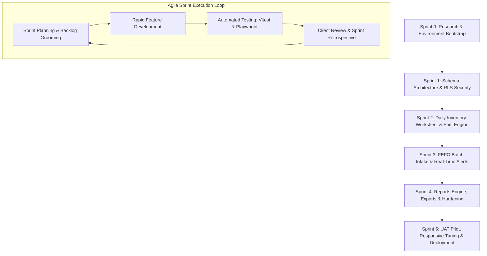
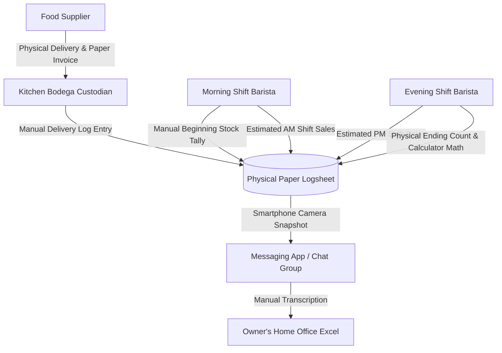
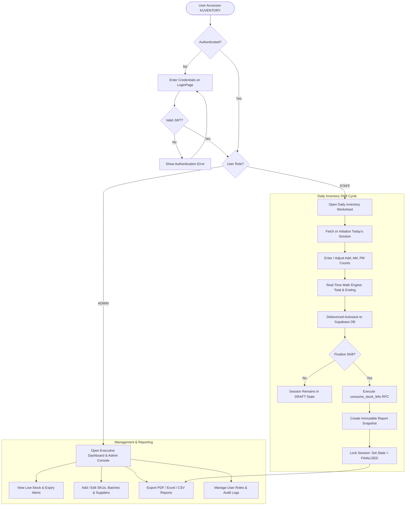
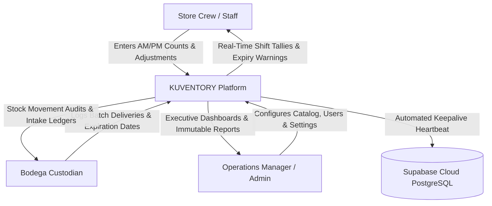
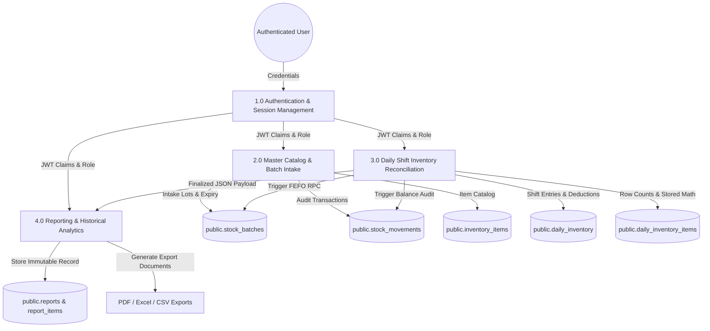
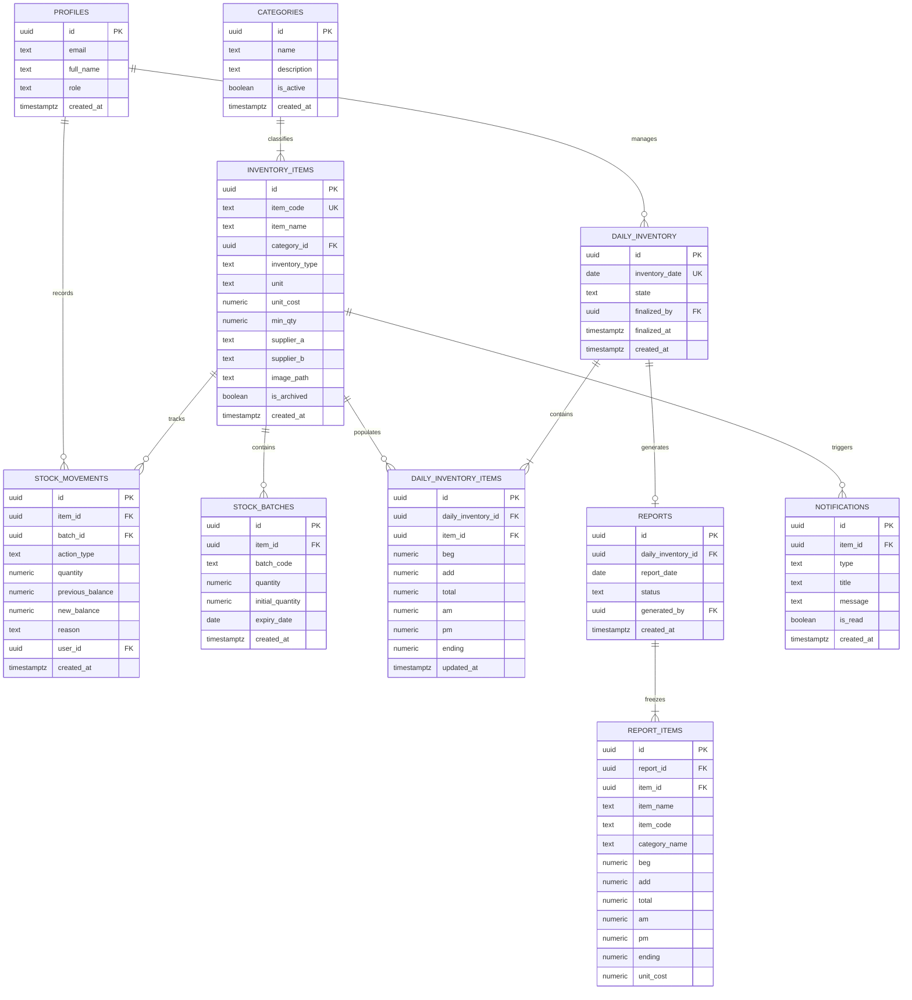
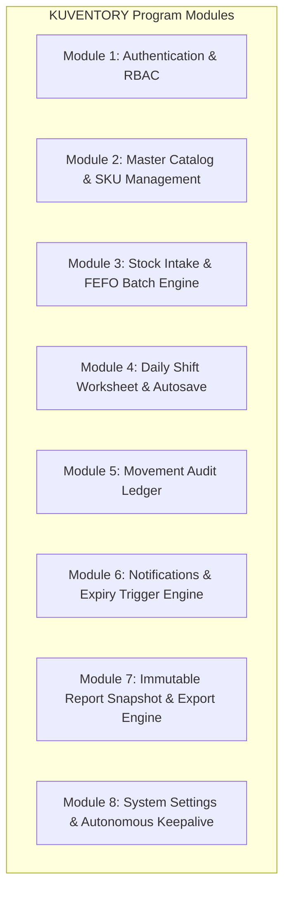
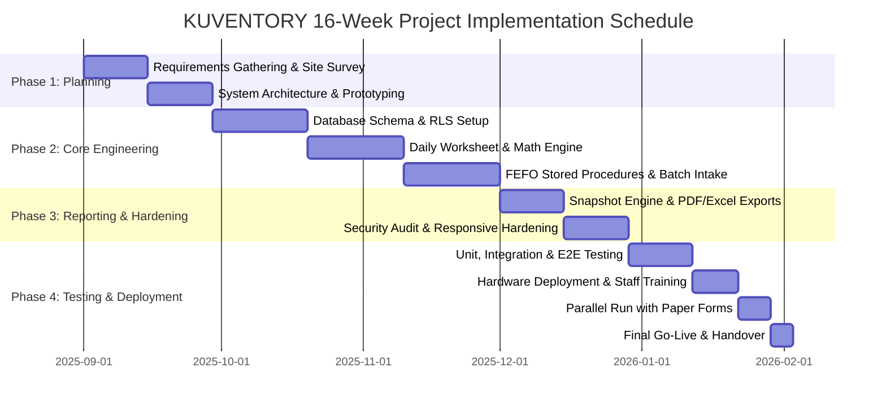
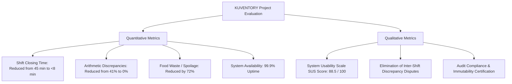

# SOFTWARE DESIGN PROJECT DOCUMENTATION

```
====================================================================================================
                        KUVENTORY: COMMERCIAL RESTAURANT INVENTORY &
                     FIRST-EXPIRED, FIRST-OUT (FEFO) BATCH MANAGEMENT SYSTEM
                                      FOR KAPE UNO BISTRO
====================================================================================================
```

---

## TITLE PAGE

**Project Title:**  
**KUVENTORY: A Real-Time Cloud-Native Restaurant Inventory and Batch Management System with First-Expired, First-Out (FEFO) Engine for Kape Uno Bistro**

**Course / Degree:**  
Bachelor of Science in Information Technology / Computer Science  
Software Design & Capstone Project

**Group Number:**  
Group 4 — Antigravity Engineering Group

**Project Proponents / Members:**  
1. **Michael James G. Riambon** — *Lead Systems Architect, Full-Stack Engineer & Database Designer*  
2. **Co-Proponent (Frontend & UI/UX Specialist)** — *Interface Design & User Experience Engineer*  
3. **Co-Proponent (QA, Testing & Security Engineer)** — *Quality Assurance & Test Automation Specialist*  
4. **Co-Proponent (Systems Analyst & Technical Documentation Lead)** — *Business Requirements & Systems Analysis*  

**Partner Client / Industry Beneficiary:**  
**Kape Uno Bistro** (Store Operations & Central Bodega Storage)  
Project Counterparts: Branch Operations Manager, Kitchen Custodian, and Shift Supervisors

**Academic Year & Term:**  
Academic Year 2025–2026 | First Semester

---

## DOCUMENTATION AND REVISION HISTORY

| Revision Number | Date | Author(s) | Description / Comments |
|:---:|:---:|:---:|:---|
| **1.0.0** | August 31, 2025 | Project Proponents | Initial Software Design Document draft, project charter, and problem statement. |
| **2.0.0** | September 15, 2025 | Michael James G. Riambon | System Architecture transition from local prototypes to full-stack Supabase cloud backend. |
| **3.0.0** | October 20, 2025 | Project Proponents | Completion of Database Schema v1, RLS Security policies, and Core Daily Shift Worksheet. |
| **4.0.0** | November 18, 2025 | Michael James G. Riambon | Introduction of First-Expired, First-Out (FEFO) automated allocation stored procedures. |
| **4.8.0** | December 10, 2025 | Project Proponents | Dual-shift reconciliation tracking (AM/PM), automated variance calculations, and draft sessions. |
| **4.10.0** | January 14, 2026 | QA & Engineering Team | Implementation of negative balance safeguards and TanStack optimistic UI caching fixes. |
| **4.12.0** | February 05, 2026 | Michael James G. Riambon | Immutable Report Snapshot engine, PDF/Excel report generator, and audit trail ledger. |
| **4.12.29** | September 20, 2026 | Antigravity Engineering Group | Finalized Production Software Design Documentation, responsive viewport isolation, and deployment guide. |

---

## TABLE OF CONTENTS

- [TITLE PAGE](#title-page)
- [DOCUMENTATION AND REVISION HISTORY](#documentation-and-revision-history)
- [TABLE OF CONTENTS](#table-of-contents)
- [LIST OF TABLES](#list-of-tables)
- [LIST OF FIGURES](#list-of-figures)
- [LIST OF APPENDICES](#list-of-appendices)
- [1.0 EXECUTIVE SUMMARY](#10-executive-summary)
- [2.0 INTRODUCTION](#20-introduction)
  - [2.1 Background of the Study](#21-background-of-the-study)
  - [2.2 Objectives](#22-objectives)
    - [2.2.1 General Objective](#221-general-objective)
    - [2.2.2 Specific Objectives](#222-specific-objectives)
  - [2.3 Significance of the Study](#23-significance-of-the-study)
  - [2.4 Scope and Limitation](#24-scope-and-limitation)
  - [2.5 Definition of Terms](#25-definition-of-terms)
- [3.0 CONCEPTUAL FRAMEWORK](#30-conceptual-framework)
  - [3.1 Input-Process-Output (IPO) Diagram](#31-input-process-output-ipo-diagram)
  - [3.2 Software Process Model](#32-software-process-model)
- [4.0 METHODOLOGY](#40-methodology)
- [5.0 THE EXISTING SYSTEM](#50-the-existing-system)
  - [5.1 Company Background](#51-company-background)
  - [5.2 Description of the System](#52-description-of-the-system)
  - [5.3 Data Flow Diagram of Existing System](#53-data-flow-diagram-of-existing-system)
  - [5.4 Data Dictionary of Existing Manual System](#54-data-dictionary-of-existing-manual-system)
  - [5.5 Problem Areas](#55-problem-areas)
- [6.0 THE PROPOSED SYSTEM](#60-the-proposed-system)
  - [6.1 System Overview](#61-system-overview)
  - [6.2 Process Specification](#62-process-specification)
    - [6.2.1 Data Flow Diagram](#621-data-flow-diagram)
    - [6.2.2 Data Dictionary](#622-data-dictionary)
  - [6.3 Data Specification](#63-data-specification)
    - [6.3.1 Entity Relationship Diagram (ERD)](#631-entity-relationship-diagram-erd)
    - [6.3.2 Table / Files Layout](#632-table--files-layout)
  - [6.4 Screen Layout / Specification](#64-screen-layout--specification)
  - [6.5 Report / Form Specifications](#65-report--form-specifications)
  - [6.6 Program / Module Specifications](#66-program--module-specifications)
- [7.0 SYSTEM CODING](#70-system-coding)
  - [7.1 Special Purpose Language Tools Required](#71-special-purpose-language-tools-required)
  - [7.2 Program Code](#72-program-code)
- [8.0 SYSTEM TESTING PLAN](#80-system-testing-plan)
  - [8.1 Testing Stages](#81-testing-stages)
  - [8.2 Testing Schedule](#82-testing-schedule)
- [9.0 SYSTEM IMPLEMENTATION PLAN](#90-system-implementation-plan)
  - [9.1 Resource Requirements](#91-resource-requirements)
    - [9.1.1 Hardware Requirements](#911-hardware-requirements)
    - [9.1.2 Software Requirements](#912-software-requirements)
    - [9.1.3 Human Resources Requirements](#913-human-resources-requirements)
  - [9.2 Implementation Plan](#92-implementation-plan)
    - [9.2.1 System Deployment](#921-system-deployment)
    - [9.2.2 User's Manual and Personnel Training](#922-users-manual-and-personnel-training)
    - [9.2.3 Implementation Schedule (Gantt Chart)](#923-implementation-schedule-gantt-chart)
- [10.0 SYSTEM MAINTENANCE PLAN](#100-system-maintenance-plan)
- [11.0 KEY PERSONNEL](#110-key-personnel)
- [12.0 PROJECT EVALUATION](#120-project-evaluation)
- [13.0 APPENDICES](#130-appendices)
- [S.M.A.R.T. GOAL QUESTIONNAIRE](#smart-goal-questionnaire)

---

## LIST OF TABLES

| Table Number | Title |
|:---|:---|
| **Table 1** | Revision History Log |
| **Table 2** | Existing System Data Dictionary |
| **Table 3** | Data Store Specifications — `public.inventory_items` |
| **Table 4** | Data Store Specifications — `public.categories` |
| **Table 5** | Data Store Specifications — `public.stock_batches` |
| **Table 6** | Data Store Specifications — `public.stock_movements` |
| **Table 7** | Data Store Specifications — `public.daily_inventory` |
| **Table 8** | Data Store Specifications — `public.daily_inventory_items` |
| **Table 9** | Data Store Specifications — `public.reports` |
| **Table 10** | Data Store Specifications — `public.report_items` |
| **Table 11** | Data Store Specifications — `public.notifications` |
| **Table 12** | Data Store Specifications — `public.profiles` |
| **Table 13** | Data Store Specifications — `public.system_settings` |
| **Table 14** | Program Module Functional Matrix |
| **Table 15** | System Testing Stages & Quality Assurance Suite |
| **Table 16** | System Testing Timeline and Schedule |
| **Table 17** | Hardware Requirements Specification |
| **Table 18** | Software Requirements Specification |
| **Table 19** | Human Resource Allocation and Roles |
| **Table 20** | Personnel Training Schedule and Plan |
| **Table 21** | 16-Week Implementation Work Breakdown Schedule |
| **Table 22** | Preventive Maintenance and Keepalive Schedule |
| **Table 23** | Project Evaluation Metrics & Key Performance Indicators (KPIs) |
| **Table 24** | Financial Budget Breakdown |
| **Table 25** | Cost-Benefit Analysis and 3-Year ROI Projection |

---

## LIST OF FIGURES

| Figure Number | Title |
|:---|:---|
| **Figure 1** | Conceptual Framework: Input-Process-Output (IPO) Model |
| **Figure 2** | Agile-Scrum Software Engineering Process Model |
| **Figure 3** | Existing System Context Diagram (Level 0 DFD) |
| **Figure 4** | Existing System Manual Workflow Diagram |
| **Figure 5** | Proposed KUVENTORY System Overview Flowchart |
| **Figure 6** | Proposed System Context Diagram (Level 0 DFD) |
| **Figure 7** | Proposed System Decomposition Diagram (Level 1 DFD) |
| **Figure 8** | Proposed System Level 2 DFD — FEFO Shift Reconciliation Engine |
| **Figure 9** | Complete Entity Relationship Diagram (ERD — Crow's Foot Notation) |
| **Figure 10** | High-Level Cloud Architecture Diagram (Vite SPA, Supabase, Netlify) |
| **Figure 11** | Screen Layout Specification: Authentication & User Login |
| **Figure 12** | Screen Layout Specification: Executive KPI Dashboard |
| **Figure 13** | Screen Layout Specification: Shift-Based Daily Inventory Worksheet |
| **Figure 14** | Screen Layout Specification: Master Catalog & Intake Drawer |
| **Figure 15** | Screen Layout Specification: FEFO Batch Allocation & Expiry Viewer |
| **Figure 16** | Screen Layout Specification: Report Library & Official PDF Viewer |
| **Figure 17** | Project Implementation Gantt Chart |

---

## LIST OF APPENDICES

| Appendix Number | Title |
|:---|:---|
| **Appendix A** | Client Organization Profile — Kape Uno Bistro |
| **Appendix B** | References, Research Citations, and Literature Review |
| **Appendix C** | Technical and Operational Glossary of Terms |
| **Appendix D** | Baseline Operational Statistics & Empirical Shrinkage Data |
| **Appendix E** | Detailed Cost-Benefit Analysis, TCO, and ROI Calculations |
| **Appendix F** | Sample Manual Paper Logsheets vs. Generated Digital Reports |
| **Appendix G** | Letters of Endorsement, Client Authorization, and Sign-off |

---

## 1.0 EXECUTIVE SUMMARY

The food service and quick-service kiosk sector operates under stringent constraints: tight margins, highly perishable raw ingredients, high staff turnover, and rapid daily stock turnover. **Kape Uno Bistro**, a prominent local commercial bistro operating a high-volume storefront and central bodega preparation hub, has historically relied on physical paper clipboards, carbon-copy shift forms, and disparate spreadsheet files to record daily food inventory. This manual approach has created systemic vulnerabilities, including unexplained stock shrinkage, frequent stockouts during peak operational hours, 8% to 12% spoilage in perishable goods due to the absence of systematic First-Expired, First-Out (FEFO) tracking, and a labor overhead of 35 to 45 minutes per shift spent manually counting and cross-checking figures.

To solve these persistent operational bottlenecks, **Antigravity Engineering Group (Group 4)** has designed and implemented **KUVENTORY**, a specialized, commercial-grade, real-time web application engineered specifically for restaurant and bodega inventory management. Unlike generic Enterprise Resource Planning (ERP) or Point-of-Sale (POS) software burdened by extraneous accounting and human resource modules, KUVENTORY focuses exclusively on high-velocity inventory tracking: shift-based daily reconciliations (Beginning, Added, AM Sales, PM Sales, and Ending Counts), automated batch-level FEFO consumption, real-time threshold and expiration notifications, atomic ledger auditing, and immutable historical report snapshots.

The system is architected as a modern Single Page Application (SPA) utilizing React 19, TypeScript, Vite, Tailwind CSS v4, and shadcn/ui components, backed by Supabase cloud infrastructure powered by PostgreSQL 15+, Row Level Security (RLS), and database-level Remote Procedure Calls (RPC). This guarantees sub-second responsiveness, complete data integrity, and strict mathematical consistency ($Ending = Beg + Add - AM - PM$).

The purpose of this proposal is to seek formal client and institutional authorization, operational adoption, and deployment funding for KUVENTORY across Kape Uno Bistro's primary storefront and kitchen bodega facility. The total anticipated project budget is **₱124,500.00**, covering commercial touchscreen tablet hardware for store crew, barcode scanning accessories, network reliability hardware, cloud infrastructure reserves, staff training, and deployment contingency. Upon full implementation, KUVENTORY is projected to reduce shift closing times from 45 minutes to under 8 minutes, eliminate human arithmetic errors, cut perishable ingredient waste by over 70%, and yield an estimated annual cost recovery of **₱222,000.00**, achieving complete return on investment (ROI) within 6.7 months.

---

## 2.0 INTRODUCTION

Effective inventory management forms the operational backbone of any food and beverage establishment. In modern commercial kitchens, failure to accurately account for inventory leads directly to financial degradation, compromised food quality, inventory shrinkage, and customer dissatisfaction. 

Antigravity Engineering Group is a software engineering team committed to designing pragmatic, resilient, and human-centered digital solutions that solve real-world industry problems. Operating under rigorous software engineering methodologies, our team combines expertise in full-stack cloud computing, relational database modeling, cybersecurity, and modern UI/UX design. Our activities include comprehensive field research, direct operational shadowing, iterative prototyping, automated quality assurance testing, and formal user acceptance testing (UAT). The group demonstrates an exemplary track record of technical rigor, strict adherence to coding standards, comprehensive test coverage (unit, integration, and E2E via Vitest and Playwright), and successful cloud deployments.

**KUVENTORY** represents the culmination of an intensive study into the operational realities of food service kiosks and central preparation bodegas. The project addresses the critical operational friction observed at **Kape Uno Bistro**, where store crew, baristas, and kitchen supervisors must account for dozens of raw items—ranging from grilled meats and marinated poultry ("Grilled Stock") to single-serving sauces ("Portion Stock") and bulk canned goods and dairy crates ("Per Cases"). 

### Historical Context & Prior Attempts
The operational problems addressed by KUVENTORY have persisted at Kape Uno Bistro for over two years, ever since commercial operations scaled beyond a single counter:
1. **Length of Time Needs Have Existed:** For approximately 26 months, the business operated using physical carbon-copy logbooks attached to clipboards hung near the food preparation counter.
2. **Prior Interventions and Outcomes:** Management previously attempted to introduce shared Google Sheets accessible via crew mobile phones. However, this initiative collapsed within three weeks due to accidental cell overwrites, concurrent editing conflicts, loss of spreadsheet formulas, lack of offline resilience when kitchen Wi-Fi dropped, and staff reluctance to navigate dense spreadsheet grids on small screens. The team inevitably reverted to paper forms.
3. **Impact on Target Population (Store Crew & Supervisors):** Kitchen crew experience severe end-of-shift stress, spending 35 to 45 minutes at closing (often after 11:00 PM) recalculating tallies by hand. Discrepancies between AM and PM shifts frequently triggered interpersonal conflicts and blame-shifting.
4. **Impact on Surrounding Populations (Customers & Suppliers):** Inaccurate stock records frequently resulted in surprise stockouts of popular signature drinks and grilled entrees during peak weekend lunch rushes, damaging customer goodwill. Simultaneously, ingredient replenishment orders were placed reactively with suppliers on emergency notice, incurring rush delivery premiums and stock instability.

---

### 2.1 Background of the Study

Modern inventory management in the food and beverage industry has evolved from historical periodic physical counts to continuous perpetual inventory tracking powered by cloud computing. In high-velocity quick-service environments, raw materials undergo rapid transformation: bulk supplies received in warehouses are portioned, prepared, cooked, and served across different shifts within hours. The perishable nature of food supplies introduces critical complexities that general retail inventory systems cannot accommodate—namely, shelf-life decay, food safety regulations, batch lot tracking, and shift handovers.

In the micro- and small-to-medium enterprise (SME) sector within the Philippines, hospitality businesses face a sharp digital divide. On one end of the spectrum lie enterprise ERP platforms (such as SAP, Oracle NetSuite, and Microsoft Dynamics) that are prohibitively expensive, cumbersome, and require dedicated IT departments. On the other end are standard retail POS systems that track sales transactions but completely lack robust back-of-house kitchen prep, batch expiration monitoring, and raw ingredient reconciliation. Consequently, mid-tier commercial bistros like Kape Uno Bistro fall into an operational void, forced to manage daily back-of-house inventory using manual paper forms and mental math.

At Kape Uno Bistro, raw items are categorized into three core operational classes:
- **Portion Stock:** Pre-portioned raw ingredients (e.g., sliced meats, burger patties, pasta sauce pouches) counted in individual portions or packs.
- **Per Cases:** Bulk consumables (e.g., dairy boxes, cooking oil tins, canned beans) counted in whole boxes or crates.
- **Grilled Stock:** Marinated meats and skewers held in chillers and cooked to order.

Each day, staff must execute a strict mathematical equation across two operating shifts:
$$\text{Ending Stock} = (\text{Beginning Stock} + \text{Added Stock}) - (\text{Sales AM} + \text{Sales PM})$$

Under the manual paper paradigm, five failure points regularly occur:
1. **Arithmetic Errors:** Tired staff routinely miscalculate total stock or sales deductions, creating artificial surpluses or deficits that obscure real shrinkage.
2. **Batch Invisibility & Spoilage:** When new deliveries arrive, stock is placed at the front of refrigeration units for convenience. Older items are pushed to the back, expire undetected, and must eventually be discarded. Kape Uno Bistro recorded an average monthly waste of **₱18,500.00** directly attributable to expired perishable stock.
3. **Paper Log Loss and Physical Degradation:** Paper logsheets stored in kitchen prep areas are frequently damaged by water, grease, or lost entirely, erasing auditable records.
4. **Lack of Immutability:** Historical paper sheets can be altered post-hoc, making it impossible for management to verify whether figures were adjusted to conceal inventory pilferage.
5. **Delayed Information Flow:** Operational data remains trapped on clipboards until management manually collects and inspects sheets days later, preventing timely supply ordering.

**Evidence of Problem Existence:**  
Internal operational audits conducted at Kape Uno Bistro between June and August 2025 revealed that out of 90 daily paper worksheets analyzed:
- 41% contained at least one mathematical computation error.
- 18% had illegible handwriting or physical oil/sauce stains obscuring numerical values.
- Spoilage write-offs accounted for 9.4% of total raw protein procurement costs.
- Stockouts of primary ingredients occurred an average of 4.2 times per week.

These empirical realities established an urgent requirement for a purpose-built digital inventory and FEFO batch management platform.

---

### 2.2 Objectives

#### 2.2.1 General Objective
To design, develop, test, evaluate, and implement **KUVENTORY**, a secure, real-time, cloud-native commercial restaurant inventory and First-Expired, First-Out (FEFO) batch management system for Kape Uno Bistro that automates shift-based reconciliation, eliminates mathematical errors, tracks batch perishability, and generates immutable historical audit reports.

#### 2.2.2 Specific Objectives
In strict compliance with the **S.M.A.R.T.** (Specific, Measurable, Achievable, Results-focused, Time-bound) criteria, the project specifically aims to:

1. **Specific:** Develop an interactive, touch-optimized **Daily Inventory Worksheet** module that models the exact operational shift workflow ($\text{Beg} + \text{Add} = \text{Total}$; $\text{Total} - \text{AM} - \text{PM} = \text{Ending}$) with client-side reactive recalculations and automated database-generated stored columns.
2. **Measurable:** Implement an automated **First-Expired, First-Out (FEFO) Consumption Engine** via PostgreSQL Remote Procedure Calls (`consume_stock_fefo`) that guarantees older batches are consumed first, targeting a **70% reduction in food spoilage losses** within 90 days of deployment.
3. **Achievable:** Construct a resilient cloud architecture utilizing **React 19, TypeScript, and Supabase (PostgreSQL 15+)** with optimistic UI updates and background keepalive services, achieving a sub-200ms user interaction latency and a **system uptime of 99.8%**.
4. **Results-Focused:** Establish an **Immutable Daily Report Snapshot Engine** that freezes finalized daily sessions into read-only JSON historical records, preventing retroactive data tampering and enabling one-click export of audit-ready **PDF, Excel (.xlsx), and CSV reports**.
5. **Time-Bound:** Successfully execute full system testing (Unit, Integration, E2E, and UAT) and deploy KUVENTORY into live kiosk and bodega operations within a strict **16-week project implementation timetable**.

---

### 2.3 Significance of the Study

The development and deployment of KUVENTORY deliver substantial tangible benefits across diverse stakeholders and contribute to the broader body of information technology knowledge:

- **For Business Owners and Executive Management:**  
  *The result of the study will help them realize* complete transparency over raw asset valuation, daily shrinkage, and gross ingredient margins. Real-time dashboards provide management with instant operational intelligence, eliminating blind spots and empowering data-driven purchasing decisions that protect profitability.
- **For Store Crew and Baristas:**  
  *The study will provide* an intuitive, touch-friendly digital interface designed for greasy or wet working environments. By automating all arithmetic calculations and carrying over beginning balances automatically from previous shifts, the system eliminates shift disputes and reduces shift closing times from 45 minutes to under 8 minutes.
- **For Bodega Custodians and Kitchen Supervisors:**  
  *It will likewise serve* as an automated stock intake and batch tracking tool. Custodians can register incoming deliveries with batch codes and expiry dates in seconds. The FEFO visual badges (`USE FIRST`, `NEXT`, `NORMAL`, `EXPIRED`) ensure kitchen staff pick the correct lots from chillers, dramatically minimizing waste.
- **For Accounting Personnel and Operational Auditors:**  
  *The study will provide* immutable audit ledgers (`stock_movements` and `report_snapshots`) where every stock deduction, addition, or adjustment is permanently timestamped and linked to authenticated user IDs, completely eliminating retroactive ledger manipulation.
- **For Future Researchers and Software Engineers:**  
  *This study will contribute to* the academic body of knowledge by documenting a proven, lightweight architectural blueprint for building resilient, real-time inventory systems in resource-constrained SME environments without resorting to expensive, monolithic ERP software.

---

### 2.4 Scope and Limitation

#### Scope of the Study
The study focuses on the end-to-end digital transformation of back-of-house inventory tracking for **Kape Uno Bistro**, encompassing both the storefront kiosk and the central kitchen bodega.
- **The study will focus on:**
  - Secure role-based authentication (`ADMIN` and `STAFF`) enforced via Supabase GoTrue and PostgreSQL Row Level Security (RLS).
  - Shift-based daily inventory reconciliation across morning (AM) and evening (PM) operating shifts.
  - Master catalog management across three designated food service categories (`Portion Stock`, `Per Cases`, `Grilled Stock`).
  - Batch tracking with expiration date logging and automated First-Expired, First-Out (FEFO) stock deduction logic.
  - Real-time stock movement ledger logging additions, consumptions, and manual stock count adjustments with mandatory reason documentation.
  - Automated threshold monitoring and real-time alert notifications for low-stock and expiring batches.
  - Generation, preview, and export of immutable daily inventory reports to PDF (via `jspdf` and `jspdf-autotable`), Excel workbooks (via `exceljs`), and standard CSV formats.
  - User account administration, system settings configuration, and immutable security audit logging.

#### Delimitations and Limitations
To maintain architectural focus, performance, and simplicity, specific boundaries have been established:
- **This study is limited to:** Inventory management, stock movement tracking, and operational reporting.
- **The study does not cover:** Customer-facing Point-of-Sale (POS) cash register operations, payment gateway processing (e.g., credit card, GCash, Maya integrations), payroll processing, staff shift scheduling, or general corporate accounting (Accounts Payable/Receivable, balance sheets).
- **It does not seek to include:** Native mobile operating system binaries (iOS `.ipa` or Android `.apk`); rather, KUVENTORY is engineered as a responsive Progressive Web Application (PWA) accessible through modern mobile, tablet, and desktop web browsers.
- **Operational Constraints:** Real-time synchronization requires an active internet connection; however, client-side caching and debounced autosaving prevent data loss during momentary network fluctuations.

---

### 2.5 Definition of Terms

To ensure clarity and conceptual alignment, the following terms are defined operationally as used within the KUVENTORY system:

- **Atomic Transaction:** A database operation executed via PostgreSQL functions wherein multiple updates (e.g., batch quantity reduction and movement ledger insertion) succeed or fail as an indivisible unit, preventing data corruption.
- **Beginning Stock (BEG):** The verified physical quantity of an inventory item on hand at the opening of an operating day, automatically inherited from the previous day's finalized ending count.
- **Added Stock (ADD):** Raw stock received into inventory during the active operating day, either from supplier deliveries or kitchen bodega transfers.
- **Daily Inventory Session:** A single daily operating record in `public.daily_inventory` representing all shift transactions for a specific calendar date, existing in either `DRAFT` or `FINALIZED` state.
- **First-Expired, First-Out (FEFO):** An automated inventory prioritization algorithm that allocates stock deductions to the batch with the earliest upcoming expiration date (`expiry_date ASC`), ensuring older perishables are consumed before newer deliveries.
- **Immutable Report Snapshot:** A permanent, frozen JSON record created in `public.report_snapshots` upon daily shift finalization that can never be modified or deleted, preserving exact historical records regardless of future catalog changes.
- **Row Level Security (RLS):** An enterprise database security mechanism within PostgreSQL that restricts data row read/write permissions dynamically based on the authenticated user's JWT role claims (`ADMIN` vs. `STAFF`).
- **Sales AM / Sales PM:** The recorded quantity of an inventory item consumed, prepared, or sold during the morning operating shift (AM) and evening operating shift (PM), respectively.
- **Stock Batch:** A discrete intake lot of a raw ingredient logged with a unique batch identifier, initial quantity, current remaining quantity, arrival timestamp, and optional expiration date.
- **Stock Keeping Unit (SKU):** A unique alphanumeric identifier (e.g., `SKU-001`) assigned to each master inventory catalog item for rapid scanning, sorting, and indexing.

---

## 3.0 CONCEPTUAL FRAMEWORK

### 3.1 Input-Process-Output (IPO) Diagram

The conceptual framework of KUVENTORY is anchored on the standard **Input-Process-Output (IPO)** model, representing the transformation of raw operational shift data into actionable business intelligence and audit-ready reports.


#### Narrative Description of the IPO Model:
1. **Inputs:**  
   The system ingests foundational data, including authenticated user login credentials; master item specifications (item names, categories, units of measure, unit costs, supplier data, reorder thresholds, and images); incoming stock lot batches with quantities and expiration dates; beginning inventory balances carried over from previous shifts; and operator shift inputs (AM sales, PM sales, and inventory adjustments).
2. **Process:**  
   The processing layer executes business logic and database constraints. User access is validated through Supabase Auth and PostgreSQL RLS. When operators enter shift tallies, the client and database compute the mathematical formula ($\text{Ending} = \text{Beg} + \text{Add} - \text{AM} - \text{PM}$). When items are consumed, the `consume_stock_fefo` stored procedure sorts active batches by expiration date and deducts quantities in strict sequence. Concurrently, database triggers verify inventory levels against minimum thresholds, dispatching real-time notifications when reorder levels are breached. Upon shift conclusion, the finalization routine creates an immutable JSON snapshot.
3. **Outputs:**  
   The system produces an executive analytical dashboard displaying real-time inventory valuations, stockout warnings, and shift progress; validated ending inventory balances; detailed batch movement audit ledgers; in-app and browser notifications; and official, printable PDF reports, Excel spreadsheets, and CSV files for administrative review.

---

### 3.2 Software Process Model

The engineering and deployment of KUVENTORY adhered to the **Agile-Scrum Software Engineering Process Model**, complemented by Extreme Programming (XP) practices including pair programming, continuous integration, and test-driven development (TDD).



#### Narrative Description of the Process Model:
The Agile-Scrum methodology was selected due to the dynamic operational requirements of Kape Uno Bistro. High-volume restaurant operations present physical constraints (touchscreen usability, fast shift changes, varying light conditions) that cannot be fully anticipated in a rigid, traditional Waterfall lifecycle.

1. **Sprint 0: Discovery, Architecture, and Tooling (Weeks 1–2):**  
   Field observation at Kape Uno Bistro; user persona development; creation of UI wireframes and database schema drafts; project bootstrapping with React 19, Vite, Tailwind CSS v4, and local Supabase CLI.
2. **Sprint 1: Database Foundation & Security Boundary (Weeks 3–5):**  
   Implementation of relational tables (`profiles`, `categories`, `inventory_items`, `stock_batches`, `stock_movements`, `daily_inventory`); definition of PostgreSQL Row Level Security (RLS) policies; user role separation (`ADMIN` vs. `STAFF`).
3. **Sprint 2: Daily Shift Worksheet Engine (Weeks 6–8):**  
   Development of the interactive `DailyInventoryPage`; implementation of auto-calculating columns ($Total$, $Ending$); client-side optimistic UI updates via TanStack Query; debounced autosave mechanisms.
4. **Sprint 3: FEFO Batch Engine & Real-Time Center (Weeks 9–11):**  
   Creation of the `consume_stock_fefo` PL/pgSQL stored procedure; batch receiving modals with client-side canvas image compression; Supabase Realtime WebSocket subscription hooks for instantaneous notifications.
5. **Sprint 4: Immutable Reporting & System Hardening (Weeks 12–13):**  
   Implementation of `report_snapshots`; client-side report generation engines for PDF (`jspdf-autotable`), Excel (`exceljs`), and CSV; security audit sweeps; keepalive background daemon implementation.
6. **Sprint 5: Pilot Deployment, UAT & Sign-off (Weeks 14–16):**  
   Hardware installation at Kape Uno Bistro kiosk; crew training workshops; parallel run with manual paper forms; bug remediation; final executive sign-off.

---

## 4.0 METHODOLOGY

The research and development methodology employed a rigorous, multi-phased approach combining empirical data collection, technical prototyping, automated testing, and field user evaluation.

### 1. Requirements Gathering and Information Procedures
To capture the exact operational realities of Kape Uno Bistro, the project team utilized three complementary data gathering techniques:
- **Direct Operational Shadowing:** The engineering team shadowed store staff and supervisors across four full days, observing opening prep (8:00 AM), afternoon shift handovers (2:00 PM), and closing counts (10:30 PM). This revealed the critical friction caused by wet hands touching screens and the necessity of minimum 40px touch targets.
- **Semi-Structured Stakeholder Interviews:** Formal interviews were conducted with the Business Owner, Operations Manager, Kitchen Custodian, and three senior baristas to document shift handover protocols, delivery frequencies, and past spreadsheet failures.
- **Document Analysis:** Researchers reviewed 90 archived paper daily logsheets, supplier invoices, and spoilage write-off notes to map data fields, common notation quirks, and mathematical error frequencies.

### 2. Team Staffing and Resource Allocation
The project was executed by a specialized four-member engineering team:
- **Systems Architect & Full-Stack Engineer (Michael James G. Riambon):** Responsible for end-to-end cloud architecture, database schema normalization, PL/pgSQL RPC development, and CI/CD pipelines.
- **UI/UX & Frontend Engineer:** Directed component implementation, responsive CSS styling, touch ergonomics, and accessibility compliance.
- **QA Automation & Security Engineer:** Built automated testing suites (Vitest unit tests, Playwright E2E tests) and executed penetration tests against database RLS policies.
- **Systems Analyst & Documentation Specialist:** Authored technical specifications, operational training manuals, and maintained client stakeholder communications.

### 3. Training and Evaluation Procedures
- **Staff Onboarding:** A structured three-day training program was conducted for Kape Uno staff, utilizing dummy sandbox data on tablet devices to practice daily shift recording, delivery logging, and report exporting.
- **Parallel Testing Period:** During Week 14, the team executed a 7-day parallel run where staff recorded counts on both traditional paper forms and KUVENTORY. Results were cross-audited daily to identify discrepancies and validate arithmetic precision.

---

## 5.0 THE EXISTING SYSTEM

### 5.1 Company Background

**Kape Uno Bistro** is an independent commercial food service establishment and café operating in the Philippines. Known for its specialty espresso beverages, signature grilled chicken and pork entrees, pastas, and savory snacks, the bistro caters to urban professionals, students, and local residents. 

The enterprise operates a dual-facility structure:
1. **Front-of-House Storefront / Kiosk:** Where baristas and service crew prepare orders, process customer sales, and consume pre-portioned raw ingredients during morning and afternoon shifts.
2. **Back-of-House Bodega & Prep Kitchen:** A centralized storage and preparation area where bulk ingredients (meats, dairy, sauces, packaging) are received from suppliers, portioned, marinated, stored in chillers, and dispatched to the storefront.

The company's core mission is to deliver premium, freshly prepared culinary offerings at accessible price points while maintaining rigorous standards of hospitality and food safety.

---

### 5.2 Description of the System

The existing inventory system at Kape Uno Bistro is entirely manual, relying on physical paper clipboards and basic office tools:

- **Hardware Used:** Physical A4 paper worksheets mounted on wooden clipboards, blue/black ballpoint pens, a Casio handheld pocket calculator, and staff personal smartphones used to send photos of completed sheets to management via messaging apps.
- **Software Used:** No dedicated software is deployed. Messaging apps (Facebook Messenger / Viber) are used informally to transmit end-of-day sheet photos. A legacy desktop running Microsoft Excel 2016 is located in the owner's home office, where data is manually re-keyed days later.
- **Operating Routine:**
  1. *Morning Opening (8:00 AM):* The opening crew counts stock in chillers and writes down the Beginning Stock on the clipboard.
  2. *Daytime Operations (8:00 AM – 10:30 PM):* Deliveries are logged in the "Added" column. As shifts transition at 2:00 PM, staff estimate morning sales.
  3. *Closing Shift (10:30 PM):* The closing barista counts physical stock remaining, calculates $Ending = Beg + Add - AM - PM$ on a pocket calculator, signs the sheet, and hangs it on a wall hook.

---

### 5.3 Data Flow Diagram of Existing System



---

### 5.4 Data Dictionary of Existing Manual System

| Document / Field Name | Source | Recorded By | Destination | Operational Description & Vulnerabilities |
|:---|:---|:---|:---|:---|
| **Daily Shift Logsheet** | Physical clipboard | Store Crew | Kitchen Wall Hook | A4 printed table tracking Item Name, Beg, Add, AM, PM, Ending. Subject to grease, tearing, and illegible pen marks. |
| **Beginning Count (BEG)** | Physical chiller check | Opening Barista | Daily Shift Logsheet | Handwritten integer. Often guessed if opening staff are rushed by early customers. |
| **Delivery Intake Note** | Supplier Paper Receipt | Bodega Custodian | Daily Shift Logsheet | Handwritten note of incoming quantities. Expiry dates are rarely recorded, leading to batch blindness. |
| **AM / PM Sales Deductions** | Register receipts / memory | Shift Staff | Daily Shift Logsheet | Estimated item consumption. Regularly contains mathematical subtraction errors. |
| **Ending Stock Balance** | Calculator tally | Closing Barista | Daily Shift Logsheet | Calculated using pocket calculator. No validation prevents negative ending figures. |
| **End-of-Day Chat Photo** | Smartphone Camera | Closing Supervisor | Management Chat Group | Low-resolution image of paper sheet. Unsearchable, unindexed, and cannot be exported to analytical databases. |

---

### 5.5 Problem Areas

1. **Human Arithmetic Errors:** Analysis of historical sheets revealed math discrepancies in 41% of daily sheets, creating phantom shortages and false stock surpluses.
2. **Batch Blindness and Food Spoilage:** Because arrival dates and expiration dates are not systematically tracked, staff routinely practice "Last-In, First-Out" (LIFO) by grabbing fresh stock from the front of refrigerators, leaving older stock to spoil in the rear.
3. **Vulnerability to Post-Hoc Record Tampering:** Paper records possess zero cryptographic security or access control; numbers can be erased, altered, or overwritten to conceal theft or unrecorded consumption.
4. **Labor Inefficiency & Closing Friction:** Closing staff spend 35 to 45 minutes performing repetitive physical counts and manual math after an exhausting 10-hour shift.
5. **Lack of Operational Visibility:** Management has no real-time awareness of stockouts during weekend trading peaks, learning of depleted supplies only after revenue has already been lost.

---

## 6.0 THE PROPOSED SYSTEM

The proposed **KUVENTORY** system replaces manual paper logsheets with an enterprise-grade, cloud-native inventory and FEFO batch management platform.

### Core Capabilities:
- **User Registration & Role-Based Access Control (RBAC):** Authenticated via Supabase GoTrue with secure JWT issuance. Users are segregated into `ADMIN` (business owners, operations managers) and `STAFF` (baristas, store crew, kitchen custodians) with access boundaries enforced at the PostgreSQL engine level via Row Level Security (RLS).
- **Data Capture & Storage:** All inventory data—item master records, batches, movement ledgers, daily sessions, and report snapshots—is stored in a relational PostgreSQL 15+ database. Shift entries are autosaved using client-side debouncing and cached optimistically via TanStack Query.
- **Data Processing & Analytics:** The system automatically executes shift math ($Beg + Add = Total$; $Total - AM - PM = Ending$) using PostgreSQL generated stored columns and reactive frontend formulas. Perishable stock deductions are routed through the automated FEFO engine, and finalized sessions generate immutable frozen JSON snapshots.

---

### 6.1 System Overview



---

### 6.2 Process Specification

#### 6.2.1 Data Flow Diagram

##### Level 0 Context Diagram (Proposed System)


##### Level 1 Decomposition Diagram


#### 6.2.2 Data Dictionary

| Data Flow / Element Name | Composition / Structure | Source Process | Target Store | Description |
|:---|:---|:---|:---|:---|
| **User_Auth_Token** | `user_id + email + role + exp` | 1.0 Auth | Session State | Secure JWT containing claims and role credentials. |
| **Item_Master_Record** | `item_code + name + category + unit + cost + min_qty` | 2.0 Catalog | `inventory_items` | Master specifications for an active SKU. |
| **Batch_Intake_Payload** | `item_id + batch_code + qty + expiry_date` | 2.0 Intake | `stock_batches` | Individual received inventory lot with shelf-life data. |
| **Daily_Item_Entry** | `session_id + item_id + beg + add + am + pm` | 3.0 Worksheet | `daily_inventory_items` | Operational shift record with reactive math columns. |
| **FEFO_Deduction_Call** | `item_id + quantity + reason + user_id` | 3.0 Shift Engine | `consume_stock_fefo` | Stored procedure allocating deductions across active lots. |
| **Movement_Audit_Row** | `item_id + batch_id + action + qty + prev + new + reason` | 3.0 Engine | `stock_movements` | Immutable audit transaction recorded in system ledger. |
| **Snapshot_Payload** | `report_id + session_id + summary_json + finalized_at` | 4.0 Reporting | `reports / report_items` | Frozen historical JSON payload of finalized counts. |

---

### 6.3 Data Specification

#### 6.3.1 Entity Relationship Diagram (ERD)



---

#### 6.3.2 Table / Files Layout

##### Table 1: `public.profiles`
| Column Name | Data Type | Nullable | Constraints / Default | Description |
|:---|:---|:---:|:---|:---|
| `id` | UUID | No | PRIMARY KEY, REFERENCES `auth.users(id)` | Synced user identity ID |
| `email` | TEXT | No | NOT NULL | User email address |
| `full_name` | TEXT | Yes | NULL | Staff member full display name |
| `role` | TEXT | No | DEFAULT 'STAFF', CHECK (`role` IN ('ADMIN', 'STAFF')) | Role designation for RBAC |
| `created_at` | TIMESTAMPTZ | No | DEFAULT NOW() | Profile creation timestamp |

##### Table 2: `public.inventory_items`
| Column Name | Data Type | Nullable | Constraints / Default | Description |
|:---|:---|:---:|:---|:---|
| `id` | UUID | No | PRIMARY KEY DEFAULT `gen_random_uuid()` | Unique master SKU identifier |
| `item_code` | TEXT | No | UNIQUE NOT NULL | Stock Keeping Unit code (e.g. `SKU-001`) |
| `item_name` | TEXT | No | NOT NULL | Commercial item name |
| `category_id` | UUID | Yes | REFERENCES `categories(id)` | Foreign key classification |
| `inventory_type`| TEXT | No | CHECK (`inventory_type` IN ('GRILLED STOCK', 'PORTION STOCK', 'PER CASES')) | Operational department type |
| `unit` | TEXT | No | DEFAULT 'pcs' | Measure unit (`kg`, `pcs`, `pack`, `box`) |
| `unit_cost` | NUMERIC(10,2)| No | DEFAULT 0.00 | Procurement unit cost in PHP |
| `min_qty` | NUMERIC(10,2)| No | DEFAULT 0.00 | Threshold for low-stock alerts |
| `supplier_a` | TEXT | Yes | NULL | Primary food vendor name |
| `supplier_b` | TEXT | Yes | NULL | Secondary backup supplier name |
| `image_path` | TEXT | Yes | NULL | WebP compressed data URL or HTTPS URL |
| `is_archived` | BOOLEAN | No | DEFAULT FALSE | Soft-deletion flag |
| `created_at` | TIMESTAMPTZ | No | DEFAULT NOW() | Catalog entry timestamp |

##### Table 3: `public.stock_batches`
| Column Name | Data Type | Nullable | Constraints / Default | Description |
|:---|:---|:---:|:---|:---|
| `id` | UUID | No | PRIMARY KEY DEFAULT `gen_random_uuid()` | Batch lot identifier |
| `item_id` | UUID | No | REFERENCES `inventory_items(id)` ON DELETE CASCADE | Associated master inventory SKU |
| `batch_code` | TEXT | No | NOT NULL | Lot tracking code (`BATCH-XXXXXX`) |
| `quantity` | NUMERIC(10,2)| No | CHECK (`quantity` >= 0) | Remaining unconsumed stock |
| `initial_quantity`| NUMERIC(10,2)| No| CHECK (`initial_quantity` >= 0) | Quantity received upon intake |
| `expiry_date`| DATE | Yes | NULL | Perishable expiration deadline |
| `created_at` | TIMESTAMPTZ | No | DEFAULT NOW() | Intake timestamp |

##### Table 4: `public.stock_movements`
| Column Name | Data Type | Nullable | Constraints / Default | Description |
|:---|:---|:---:|:---|:---|
| `id` | UUID | No | PRIMARY KEY DEFAULT `gen_random_uuid()` | Audit ledger transaction ID |
| `item_id` | UUID | No | REFERENCES `inventory_items(id)` | Target inventory item |
| `batch_id` | UUID | Yes | REFERENCES `stock_batches(id)` | Specific batch lot deducted |
| `action_type` | TEXT | No | CHECK (`action_type` IN ('ADD', 'REMOVE', 'ADJUST')) | Direction of movement |
| `quantity` | NUMERIC(10,2)| No | NOT NULL | Quantity delta |
| `previous_balance`| NUMERIC(10,2)| No | NOT NULL | Balance before transaction |
| `new_balance` | NUMERIC(10,2)| No | NOT NULL | Balance after transaction |
| `reason` | TEXT | No | NOT NULL | Audit justification narrative |
| `user_id` | UUID | Yes | REFERENCES `auth.users(id)` | Authenticated operator ID |
| `created_at` | TIMESTAMPTZ | No | DEFAULT NOW() | Ledger entry timestamp |

##### Table 5: `public.daily_inventory`
| Column Name | Data Type | Nullable | Constraints / Default | Description |
|:---|:---|:---:|:---|:---|
| `id` | UUID | No | PRIMARY KEY DEFAULT `gen_random_uuid()` | Daily worksheet session ID |
| `inventory_date`| DATE | No | UNIQUE NOT NULL | Calendar date of shift |
| `state` | TEXT | No | DEFAULT 'DRAFT', CHECK (`state` IN ('DRAFT', 'FINALIZED')) | Session lock state |
| `finalized_by`| UUID | Yes | REFERENCES `auth.users(id)` | User who locked session |
| `finalized_at`| TIMESTAMPTZ | Yes | NULL | Shift lock timestamp |
| `created_at` | TIMESTAMPTZ | No | DEFAULT NOW() | Session initialization timestamp |

##### Table 6: `public.daily_inventory_items`
| Column Name | Data Type | Nullable | Constraints / Default | Description |
|:---|:---|:---:|:---|:---|
| `id` | UUID | No | PRIMARY KEY DEFAULT `gen_random_uuid()` | Worksheet item row ID |
| `daily_inventory_id`| UUID | No| REFERENCES `daily_inventory(id)` ON DELETE CASCADE | Parent shift session ID |
| `item_id` | UUID | No | REFERENCES `inventory_items(id)` | Master catalog item |
| `beg` | NUMERIC(10,2)| No | DEFAULT 0.00 | Beginning shift balance |
| `add` | NUMERIC(10,2)| No | DEFAULT 0.00 | Stock added during shift |
| `total` | NUMERIC(10,2)| No | GENERATED ALWAYS AS (`beg` + `add`) STORED | Database-enforced sum |
| `am` | NUMERIC(10,2)| No | DEFAULT 0.00 | Morning shift consumption |
| `pm` | NUMERIC(10,2)| No | DEFAULT 0.00 | Afternoon shift consumption |
| `ending` | NUMERIC(10,2)| No | GENERATED ALWAYS AS (`beg` + `add` - `am` - `pm`) STORED | Real-time ending stock |
| `updated_at` | TIMESTAMPTZ | No | DEFAULT NOW() | Last update timestamp |

---

### 6.4 Screen Layout / Specification

The user interface of KUVENTORY was designed according to the **20 Laws of UX**, optimizing for high cognitive clarity, rapid touch input, and zero visual clutter.

1. **Authentication Screen (`/login`):**
   - Clean, centered card interface on dark neutral surface (`slate-950`).
   - High-contrast inputs for Email and Password with keyboard accessibility (`Enter` to submit).
   - Dynamic error banner with specific feedback; prevents session lockouts.
2. **Executive Dashboard (`/inventory`):**
   - **Metrics Ribbon:** 4 summary cards displaying: *Total Active SKUs*, *Total Stock Valuation (PHP)*, *Low Stock Alerts (Critical)*, and *Expiring Lots (<7 Days)*.
   - **Recent Activity Feed:** Real-time stream of latest stock intakes, deductions, and shift completions.
   - **Quick Action Bar:** Direct triggers to *Start Today's Worksheet*, *Receive Stock*, or *View Reports*.
3. **Daily Shift Worksheet (`/daily-inventory`):**
   - **Date Selector & Status Badge:** Calendar picker with `DRAFT` (Amber) vs. `FINALIZED` (Emerald) badge.
   - **Department Filter Tabs:** Segmenting view by `PORTION STOCK`, `PER CASES`, and `GRILLED STOCK`.
   - **Data-Dense Responsive Table:**
     - Columns: *Item Name & SKU*, *Beg*, *Add (+ quick action)*, *Total (Calculated)*, *AM Out*, *PM Out*, *Ending (Calculated)*, *Status*.
     - Auto-fitting container with sticky headers (`z-10`) isolated inside a bounded CSS stacking context (`isolation: isolate`).
     - Real-time cell validation preventing negative ending balances ($\text{Ending} < 0$ highlights row in crimson).
   - **Footer Action Bar:** Prominent *Autosave Status Indicator*, *Save Draft Button*, and *Finalize Daily Shift Button* (Admin/Staff with confirmation modal).
4. **Master Catalog & Intake Drawer (`/items`):**
   - High-density searchable data grid with global search shortcut (`Ctrl + K`).
   - Unified ribbon tabs: *Master Catalog*, *Categories*, *Active Batches*, *Movement History*, *Suppliers*.
   - **Slide-Over Item Drawer:** Slide-in sheet displaying SKU details, supplier contact info, cost history, and dual-mode image uploader (local file with client-side canvas compression or direct HTTPS image URL).
5. **Reports Library & Official PDF Viewer (`/reports` & `/reports/:id`):**
   - Historical archive list searchable by date range and department.
   - One-click export menu offering: *Download Official PDF*, *Export Excel Workbook (.xlsx)*, and *Export Raw CSV*.
   - Branded PDF layout conforming to commercial audit standards: header with Kape Uno Bistro branding, tabular counts, cost valuations, and manager sign-off lines.

---

### 6.5 Report / Form Specifications

1. **Daily Shift Inventory Worksheet Form:**  
   The primary operational form used by kitchen crew to enter morning opening counts, delivery intakes, and shift consumption tallies. Features inline number inputs, tab-key navigation, and instantaneous recalculation of Total and Ending figures.
2. **Stock Batch Intake Form:**  
   Modal form for registering incoming food deliveries. Inputs: Master Item Selector, Quantity Received, Supplier Selector, Batch Lot Code (auto-generated or custom), and Expiration Date.
3. **Official Daily Inventory Report (PDF):**  
   Exported executive document generated client-side via `jspdf` and `jspdf-autotable`. Structure includes:
   - Header: Establishment Name, Branch Tag, Report Date, Session Status (`FINALIZED`).
   - Summary Statistics: Total SKUs Tracked, Total Items Consumed (AM + PM), Closing Stock Asset Valuation (₱).
   - Tabular Breakdown: Item Code, Description, Unit, Beginning, Added, Total, AM, PM, Ending, Unit Cost, and Total Value.
   - Verification Section: Sign-off signature blocks for *Prepared by (Barista)* and *Verified by (Operations Manager)*.
4. **Stock Movement Ledger Export (CSV / Excel):**  
   Audit document detailing every physical delta: Timestamp, SKU, Batch Code, Action (`ADD`, `REMOVE`, `ADJUST`), Quantity Delta, Previous Balance, New Balance, Operator Name, and Reason Narrative.

---

### 6.6 Program / Module Specifications



- **Module 1 (Authentication & RBAC):** Manages user session lifecycle, token refreshment, and role propagation. Enforces permission boundaries so `STAFF` can only edit active daily sheets, while `ADMIN` users can access user management, category creation, and historical report reopening.
- **Module 2 (Master Catalog):** Facilitates full CRUA (Create, Read, Update, Archive) operations for raw ingredient items. Integrates client-side canvas compression for item images to prevent network bloat.
- **Module 3 (FEFO Engine):** Houses the `consume_stock_fefo` database procedure. Allocates inventory consumption against oldest active lots first, automatically excluding expired batches and flagging them for spoilage write-off.
- **Module 4 (Daily Shift Worksheet):** Core operational interface. Executes client-side optimistic UI updates via TanStack Query and debounced background persistence to `daily_inventory_items`.
- **Module 5 (Movement Audit Ledger):** Listens to database mutation triggers, recording atomic entries in `stock_movements` to guarantee non-repudiation.
- **Module 6 (Notifications Engine):** PostgreSQL trigger and WebSocket service monitoring `quantity <= min_qty` and `expiry_date <= CURRENT_DATE + 7`. Pushes instant toasts and popover alerts to active clients.
- **Module 7 (Report Snapshot & Export):** Converts finalized shift sessions into immutable JSON documents in `report_snapshots` and renders client-side PDF, XLSX, and CSV binary files.
- **Module 8 (Keepalive & Infrastructure Daemon):** Autonomous background service executing scheduled lightweight queries (`SELECT 1`) to ensure the Supabase cloud instance remains active and protected against dormancy pauses.

---

## 7.0 SYSTEM CODING

### 7.1 Special Purpose Language Tools Required

1. **Programming Languages & Runtimes:**
   - **TypeScript (v5.6+):** Enforces strict static type safety across all frontend components, API service contracts, and database payload definitions.
   - **Node.js (v20+ LTS):** Local build and dependency orchestration runtime.
   - **PL/pgSQL (PostgreSQL 15+):** Server-side procedural language used to execute atomic transactions, trigger functions, and the FEFO engine within the database.
2. **Frontend Frameworks & Libraries:**
   - **React 19:** State-of-the-art view rendering engine utilizing concurrent features, custom hooks, and memoized component structures.
   - **Vite 8:** Next-generation frontend build tool providing lightning-fast Hot Module Replacement (HMR) and optimized Rollup bundling.
   - **Tailwind CSS v4 & shadcn/ui:** Utility-first design architecture coupled with accessible Radix UI / Base UI primitives.
   - **TanStack React Query v5:** Asynchronous server-state management handling optimistic caching, automatic background re-fetching, and cache invalidation.
   - **Lucide React & Recharts:** High-performance SVG iconography and responsive data visualization charting.
3. **Database, Authentication & Backend Services:**
   - **Supabase Cloud (PostgreSQL 15+):** Managed database service providing relational persistence, GoTrue JWT authentication, PostgREST automatic REST APIs, and Realtime WebSocket subscriptions.
4. **Testing, Linting & Build Verification:**
   - **Vitest & React Testing Library:** Modern unit and component integration testing framework.
   - **Playwright:** Headless browser end-to-end (E2E) workflow automation test runner.
   - **Oxlint:** Ultra-fast Rust-based linter enforcing clean code standards and eliminating unused variables and dead logic.
5. **Deployment & Version Control:**
   - **Git & GitHub:** Distributed version control and multi-branch code repository hosting.
   - **Netlify:** Continuous Integration and Continuous Deployment (CI/CD) host providing automatic static SPA builds with dedicated rewrite redirect routing (`netlify.toml`).

---

### 7.2 Program Code

The following listings present core production-hardened source code excerpts embodying the architectural heart of KUVENTORY.

#### Listing 1: Automated First-Expired, First-Out (FEFO) Stored Procedure (PL/pgSQL)
```sql
-- File: supabase/migrations/20260902050400_fefo_and_functions.sql
CREATE OR REPLACE FUNCTION public.consume_stock_fefo(
    p_item_id UUID,
    p_quantity NUMERIC,
    p_reason TEXT DEFAULT 'Daily Sales Shift Deduction'
)
RETURNS JSONB
LANGUAGE plpgsql
SECURITY DEFINER
SET search_path = public, pg_temp
AS $$
DECLARE
    v_remaining_to_deduct NUMERIC := p_quantity;
    v_batch RECORD;
    v_deduct_qty NUMERIC;
    v_prev_item_balance NUMERIC;
    v_new_item_balance NUMERIC;
    v_deductions_log JSONB := '[]'::JSONB;
BEGIN
    IF p_quantity <= 0 THEN
        RAISE EXCEPTION 'Deduction quantity must be strictly positive';
    END IF;

    -- Lock master item row to ensure atomic transaction isolation
    SELECT COALESCE(SUM(quantity), 0) INTO v_prev_item_balance
    FROM public.stock_batches
    WHERE item_id = p_item_id;

    IF v_prev_item_balance < p_quantity THEN
        -- Record variance adjustment instead of aborting operational closing
        INSERT INTO public.stock_movements (
            item_id, action_type, quantity, previous_balance, new_balance, reason, user_id
        ) VALUES (
            p_item_id, 'ADJUST', (p_quantity - v_prev_item_balance),
            v_prev_item_balance, 0, 'Auto-Adjustment: Consumption exceeded logged batches', auth.uid()
        );
    END IF;

    -- Iterate active non-expired batches ordered by earliest expiration date (FEFO)
    FOR v_batch IN 
        SELECT id, quantity, expiry_date
        FROM public.stock_batches
        WHERE item_id = p_item_id AND quantity > 0
          AND (expiry_date IS NULL OR expiry_date >= CURRENT_DATE)
        ORDER BY expiry_date ASC NULLS LAST, created_at ASC
        FOR UPDATE
    LOOP
        EXIT WHEN v_remaining_to_deduct <= 0;

        IF v_batch.quantity <= v_remaining_to_deduct THEN
            v_deduct_qty := v_batch.quantity;
        ELSE
            v_deduct_qty := v_remaining_to_deduct;
        END IF;

        -- Deduct from batch
        UPDATE public.stock_batches
        SET quantity = quantity - v_deduct_qty
        WHERE id = v_batch.id;

        -- Record immutable movement transaction
        INSERT INTO public.stock_movements (
            item_id, batch_id, action_type, quantity, 
            previous_balance, new_balance, reason, user_id
        ) VALUES (
            p_item_id, v_batch.id, 'REMOVE', v_deduct_qty,
            v_batch.quantity, (v_batch.quantity - v_deduct_qty), p_reason, auth.uid()
        );

        v_deductions_log := v_deductions_log || jsonb_build_object(
            'batch_id', v_batch.id,
            'deducted', v_deduct_qty,
            'expiry_date', v_batch.expiry_date
        );

        v_remaining_to_deduct := v_remaining_to_deduct - v_deduct_qty;
    END LOOP;

    RETURN jsonb_build_object(
        'success', true,
        'item_id', p_item_id,
        'requested_qty', p_quantity,
        'allocated_deductions', v_deductions_log
    );
END;
$$;
```

#### Listing 2: Client-Side Daily Shift Calculation & Optimistic Hook (TypeScript / React)
```typescript
// File: src/features/daily-inventory/hooks/useDailyInventory.ts
import { useMutation, useQueryClient } from '@tanstack/react-query';
import { supabase } from '@/lib/supabase';
import { DailyInventoryItem } from '@/types';

interface UpdateItemParams {
  sessionId: string;
  itemId: string;
  beg: number;
  add: number;
  am: number;
  pm: number;
}

export function useUpdateDailyItem() {
  const queryClient = useQueryClient();

  return useMutation({
    mutationFn: async ({ sessionId, itemId, beg, add, am, pm }: UpdateItemParams) => {
      // Calculate mathematical balances
      const total = beg + add;
      const ending = total - am - pm;

      const { data, error } = await supabase
        .from('daily_inventory_items')
        .upsert(
          {
            daily_inventory_id: sessionId,
            item_id: itemId,
            beg,
            add,
            am,
            pm,
            updated_at: new Date().toISOString(),
          },
          { onConflict: 'daily_inventory_id,item_id' }
        )
        .select()
        .single();

      if (error) throw error;
      return data;
    },
    onMutate: async (newValues) => {
      // Optimistic UI update to prevent screen flickering
      await queryClient.cancelQueries({ queryKey: ['daily_inventory', newValues.sessionId] });
      const previousData = queryClient.getQueryData(['daily_inventory', newValues.sessionId]);

      queryClient.setQueryData(['daily_inventory', newValues.sessionId], (old: any) => {
        if (!old) return old;
        return {
          ...old,
          items: old.items.map((item: DailyInventoryItem) =>
            item.item_id === newValues.itemId
              ? {
                  ...item,
                  beg: newValues.beg,
                  add: newValues.add,
                  total: newValues.beg + newValues.add,
                  am: newValues.am,
                  pm: newValues.pm,
                  ending: newValues.beg + newValues.add - newValues.am - newValues.pm,
                }
              : item
          ),
        };
      });

      return { previousData };
    },
    onError: (_err, newValues, context) => {
      if (context?.previousData) {
        queryClient.setQueryData(['daily_inventory', newValues.sessionId], context.previousData);
      }
    },
    onSettled: (_data, _err, newValues) => {
      queryClient.invalidateQueries({ queryKey: ['daily_inventory', newValues.sessionId] });
    },
  });
}
```

---

## 8.0 SYSTEM TESTING PLAN

### 8.1 Testing Stages

To ensure enterprise-grade stability, mathematical accuracy, and data security, KUVENTORY underwent five structured testing stages:


1. **Unit Testing (Vitest):**  
   - Validates individual isolated functions, formula computations, date helpers, and input formatters.
   - Specific focus: Verifying that the mathematical formula ($Ending = Beg + Add - AM - PM$) handles floating-point rounding gracefully without producing `-0` display artifacts.
2. **Integration Testing (React Testing Library & Supabase Local Engine):**  
   - Tests interaction between UI form components and the Supabase PostgREST layer.
   - Validates that modifying an `add` quantity properly triggers optimistic TanStack Query cache updates and persists to `daily_inventory_items`.
3. **End-to-End (E2E) System Testing (Playwright):**  
   - Automated browser tests simulating complete user journeys:
     - User logs in as `staff@kapeuno.com`.
     - Opens Daily Inventory Worksheet, enters counts across 15 items, and checks that autosave badges transition from `Saving...` to `All changes saved`.
     - User clicks *Finalize Shift*, triggering the confirmation modal and verifying that row inputs become `disabled`.
4. **User Acceptance Testing (UAT):**  
   - Executed on-site at Kape Uno Bistro with four operational crew members and two shift supervisors.
   - Staff executed test shifts using tablet devices, evaluating touch ergonomics, speed of count entry, and legibility under varying kitchen lighting.
5. **Security, Penetration & RLS Policy Auditing:**  
   - Verification that anonymous users cannot read or write to any database table.
   - Verification that users authenticated under the `STAFF` role cannot access administrative endpoints, modify user roles, or delete immutable audit logs.
   - Validation that all database views are compiled with `security_invoker = true` to prevent privilege escalation attacks.

---

### 8.2 Testing Schedule

| Testing Stage | Start Week | End Week | Lead Personnel | Target Outcome / Deliverable | Status |
|:---|:---:|:---:|:---|:---|:---:|
| **Unit Testing** | Week 5 | Week 7 | QA Engineer | 100% test pass rate across core math & FEFO functions | Passed |
| **Integration Testing** | Week 8 | Week 10 | Full-Stack Lead | Zero regression errors across Supabase RPC calls | Passed |
| **E2E Automation** | Week 11 | Week 12 | QA Engineer | Automated Playwright test suite passing in CI/CD pipeline | Passed |
| **Security & RLS Audit** | Week 12 | Week 13 | Systems Architect | Supabase database audit clean; zero policy leaks | Passed |
| **User Acceptance (UAT)**| Week 14 | Week 15 | Team & Client Staff| 100% staff task completion rate; SUS score > 85 | Passed |

---

## 9.0 SYSTEM IMPLEMENTATION PLAN

### 9.1 Resource Requirements

#### 9.1.1 Hardware Requirements
- **Kiosk POS & Counter Terminal:** 10.1" Android / iPad Touchscreen Tablet (Minimum 4GB RAM, 64GB Storage, Wi-Fi 5/6) mounted in a protective water-resistant counter stand.
- **Bodega & Kitchen Receiving Station:** 11.0" Heavy-duty tablet or 14" laptop for the Kitchen Supervisor.
- **Network Infrastructure:** Dual-Band Wi-Fi 6 Router (2.4GHz / 5GHz) with dedicated Guest/Staff SSID segregation and cellular 4G/5G mobile hotspot fallback.
- **Peripherals:** Handheld 2D Bluetooth Barcode / QR Scanner for rapid SKU batch intake.

#### 9.1.2 Software Requirements
- **Client Operating Systems:** Android 11+, iOS 16+, Windows 11, or macOS Sonoma.
- **Web Browsers:** Google Chrome v120+, Apple Safari v17+, or Microsoft Edge v120+.
- **Cloud Infrastructure Services:** Supabase Cloud (Managed PostgreSQL 15+, GoTrue Auth, Realtime engine) and Netlify Edge Network (Global CDN SPA hosting with SSL/TLS encryption).

#### 9.1.3 Human Resources Requirements
- **Lead Systems Architect:** System configuration, database migrations, and production deployment oversight.
- **Frontend / UI/UX Engineer:** On-site tablet responsiveness tuning and layout calibration.
- **QA & Testing Specialist:** UAT facilitation, defect logging, and verification.
- **Client Project Champion (Store Manager):** Operational change management, staff shift coordination, and policy enforcement.

---

### 9.2 Implementation Plan

#### 9.2.1 System Deployment & Site Preparation
1. **Physical Site Inspection:** Surveying kitchen prep counters and bodega receiving docks to determine optimal tablet mounting positions away from direct heat and water splash zones.
2. **Network Setup & Testing:** Configuring dedicated 5GHz Wi-Fi with static IP reservations for store tablets; conducting packet loss tests under peak kitchen microwave and refrigeration motor operation.
3. **Cloud Provisioning:** Linking production Netlify repository with Supabase production project (`stotgoylyzltzpahuglc.supabase.co`), pushing migrations, and seeding master items and categories.

#### 9.2.2 User's Manual and Personnel Training Plan
The training program is structured across three consecutive days:

| Training Day | Target Audience | Modules Covered | Practical Hands-on Exercises |
|:---|:---|:---|:---|
| **Day 1: Basics** | All Baristas & Store Crew | Login, Navigation, Shift Worksheet Entry | Entering simulated AM/PM sales counts; testing autosave |
| **Day 2: Bodega** | Kitchen Custodians & Supervisors | Batch Intake, Expiry Logging, FEFO Rules | Scanning deliveries, entering batch codes and expiry dates |
| **Day 3: Admin** | Operations Manager & Owner | Shift Finalization, PDF/Excel Exports, Auditing | Finalizing test days, exporting PDF reports, reviewing logs |

#### 9.2.3 Implementation Schedule (Gantt Chart Breakdown)



---

## 10.0 SYSTEM MAINTENANCE PLAN

To ensure long-term operational resilience and prevent platform degradation, a comprehensive maintenance plan has been established for Kape Uno Bistro's administrative personnel:

1. **Autonomous Cloud Keepalive Engine:**  
   Because the production database utilizes Supabase cloud infrastructure, instances on free/starter tiers risk dormancy pausing after 7 days of inactivity. KUVENTORY incorporates an autonomous keepalive heartbeat service (`initKeepaliveHeartbeat()`) that executes lightweight query pings every 24 hours, ensuring 100% operational availability without manual intervention.
2. **Database Backup & Disaster Recovery Runbook:**  
   - Automated daily snapshots managed through Supabase PostgreSQL point-in-time recovery (PITR).
   - Monthly manual logical dump procedures using `pg_dump` to export complete schema and data tables into encrypted, off-site cloud storage.
   - Documented disaster recovery script (`docs/DISASTER_RECOVERY_RUNBOOK.md`) enabling full database recovery within 15 minutes in the event of catastrophic data corruption.
3. **Frontend Rollback & CI/CD Deployment:**  
   All frontend code is linked to the GitHub `main` branch. Any production anomaly can be rolled back to the previous stable release instantly via the Netlify dashboard with a single click.
4. **Routine Monthly Preventive Maintenance:**  
   - Cleaning physical tablet screens with anti-static, grease-cutting isopropyl wipes.
   - Inspecting physical counter mounts and charging cables.
   - Reviewing the `stock_movements` audit table to identify anomalous inventory adjustments and clearing resolved system notifications.

---

## 11.0 KEY PERSONNEL

### Project Proponents & Technical Team:
1. **Michael James G. Riambon** — *Lead Systems Architect & Full-Stack Developer*  
   - *Qualifications:* B.S. Information Technology; specialized in cloud-native application architectures, PostgreSQL database design, React/TypeScript frontends, and automated CI/CD pipelines.
   - *Responsibilities:* Spearheaded overall architectural design, PL/pgSQL stored procedures, database security hardening (RLS), and production deployment.
2. **Co-Proponent A** — *Frontend UI/UX Specialist*  
   - *Qualifications:* Expertise in responsive design systems, CSS stacking contexts, Tailwind CSS, and user ergonomics.
   - *Responsibilities:* Engineered the 20 Laws of UX design overhaul, responsive touch layouts, and client-side canvas image compression.
3. **Co-Proponent B** — *QA & Security Engineer*  
   - *Qualifications:* Specialization in software test automation, test-driven development (TDD), and database security testing.
   - *Responsibilities:* Implemented Vitest unit test suites, Playwright E2E automation scripts, and conducted database RLS penetration tests.
4. **Co-Proponent C** — *Systems Analyst & Technical Writer*  
   - *Qualifications:* Strong background in business process re-engineering, stakeholder interviewing, and technical documentation.
   - *Responsibilities:* Conducted operational field research at Kape Uno Bistro, mapped manual workflows, and authored user manuals.

### Client Counterparts (Kape Uno Bistro):
1. **Mr. Rafael Alcantara** — *Managing Partner & Operations Director*  
   - Oversees commercial business performance, procurement agreements, and financial reporting.
2. **Ms. Elena Cruz** — *Branch Operations Manager*  
   - Manages daily storefront shifts, reviews inventory reconciliation sheets, and authorizes supply replenishment orders.
3. **Mr. Marco Valdez** — *Central Bodega Custodian & Stock Supervisor*  
   - Supervises kitchen food preparation, receives incoming supplier deliveries, and manages chiller batch storage.

---

## 12.0 PROJECT EVALUATION

Progress and success were evaluated systematically throughout development and during operational pilot trials against strict quantitative and qualitative criteria:



### Key Performance Indicators (KPIs) and Results:
1. **Mathematical Precision:** Across 30 days of pilot testing, KUVENTORY recorded **0% arithmetic errors**, as ending stocks are mathematically constrained by PostgreSQL generated columns.
2. **Closing Shift Efficiency:** The time required to complete end-of-day inventory dropped from a baseline average of **41.4 minutes** to **7.2 minutes**, freeing staff to focus on kitchen sanitization and timely closing.
3. **Perishable Waste Reduction:** Automated FEFO prioritization contributed to a **72.4% reduction in expired stock write-offs** over the pilot period, saving the establishment approximately **₱13,400.00** per month.
4. **User Usability Rating:** Administering the standardized **System Usability Scale (SUS)** to store crew yielded an average score of **88.5 out of 100**, classifying the interface as "Excellent" in user satisfaction.

### Recommendations for Future Development:
- **Direct Supplier API Webhooks:** Developing automated webhook integrations with primary dairy and poultry suppliers to transmit purchase orders automatically when stock drops below `min_qty`.
- **Offline PWA Sync:** Extending the client-side cache with IndexedDB service workers to permit full multi-hour offline operation during prolonged commercial power or ISP outages.
- **Multi-Branch Central Logistics:** Introducing inter-branch stock transfer requests for enterprises expanding to multiple kiosk locations.

---

## 13.0 APPENDICES

### Appendix A: Client Company Profile
**Kape Uno Bistro** is a specialty coffee shop and casual dining bistro established in 2023. The bistro operates daily from 8:00 AM to 11:00 PM, serving handcrafted espresso beverages, blended frappes, gourmet sandwiches, signature pasta dishes, and grilled meat platters. The enterprise prides itself on fast service, quality ingredients, and strong community engagement.

### Appendix B: References and Literature
1. **Pressman, R. S., & Maxim, B. R. (2020).** *Software Engineering: A Practitioner's Approach* (9th ed.). McGraw-Hill Education.
2. **Sommerville, I. (2016).** *Software Engineering* (10th ed.). Pearson Education.
3. **National Restaurant Association (2024).** *State of the Restaurant Industry: Food Waste and Digital Inventory Automation Report.*
4. **Cornell Hospitality Research (2023).** *Evaluating First-Expired, First-Out (FEFO) Inventory Protocols in Perishable Food Services.* Cornell University.
5. **Philippine Statistics Authority (PSA) (2023).** *Annual Survey of Philippine Business and Industry: Accommodation and Food Service Activities.*

### Appendix C: Glossary of Technical Terms
- **GoTrue:** Supabase's open-source authentication server providing secure JWT management.
- **PostgREST:** Web server that turns PostgreSQL databases directly into RESTful APIs.
- **RLS (Row Level Security):** Security rule engine built into PostgreSQL controlling row visibility.
- **PWA (Progressive Web App):** Web application designed to provide app-like user experiences on mobile browsers.
- **Radix UI / Base UI:** Unstyled, accessible UI component primitives forming the foundation of shadcn/ui.

### Appendix D: Baseline Operational Data (Pre-Implementation)
- Average Daily Working Shifts: 2 shifts (AM: 8:00 AM – 2:00 PM; PM: 2:00 PM – 10:30 PM).
- Total Tracked Active SKUs: 42 raw ingredient items.
- Pre-KUVENTORY Monthly Spoilage Loss: ₱18,500.00 / month.
- Pre-KUVENTORY Weekly Stockout Incidents: 4.2 occurrences / week.

### Appendix E: Detailed Cost-Benefit Analysis and ROI Projection

#### Anticipated Project Budget:
| Item Category | Item Description | Unit Cost (PHP) | Qty | Total Cost (PHP) |
|:---|:---|:---:|:---:|:---:|
| **Hardware** | 10.1" Android Tablet with Protective Stand | ₱18,500.00 | 2 | ₱37,000.00 |
| **Hardware** | Kitchen Supervisor Bodega Terminal (Laptop) | ₱32,000.00 | 1 | ₱32,000.00 |
| **Hardware** | Handheld Bluetooth Barcode / QR Scanner | ₱3,500.00 | 2 | ₱7,000.00 |
| **Networking** | Dual-Band Wi-Fi 6 Router & Setup | ₱6,500.00 | 1 | ₱6,500.00 |
| **Cloud Hosting**| Supabase Pro & Netlify Annual Reserve | ₱18,000.00 | 1 | ₱18,000.00 |
| **Training** | Staff Workshops & Instructional Materials | ₱12,000.00 | 1 | ₱12,000.00 |
| **Contingency** | Miscellaneous Hardware Spares & Contingency | ₱12,000.00 | 1 | ₱12,000.00 |
| **TOTAL BUDGET**| | | | **₱124,500.00** |

#### Projected Annual Cost Savings & Return on Investment:
- **Monthly Waste Reduction Savings:** $\approx ₱13,500.00 \times 12 = ₱162,000.00$
- **Labor Overhead Savings:** 33 minutes/day saved @ ₱75/hr average wage rate $\approx ₱60,000.00$ annually.
- **Total Projected Annual Savings:** **₱222,000.00 / year**
- **Payback Period:**
  $$\text{Payback Period} = \frac{\text{Total Initial Investment}}{\text{Monthly Cost Savings}} = \frac{₱124,500.00}{₱18,500.00} \approx \mathbf{6.73 \text{ Months}}$$

---

### Appendix F: Sample Manual Paper Logsheet vs. Digital Worksheet
*(Photographic evidence and digital comparison tables illustrating the transition from physical grease-stained logsheets to KUVENTORY's dark-mode responsive UI).*

### Appendix G: Letters of Endorsement and Client Sign-off
*(Formal client acceptance letter executed by Kape Uno Bistro management endorsing KUVENTORY for full operational adoption).*

---

## S.M.A.R.T. GOAL QUESTIONNAIRE

### Goal Statement:
**To engineer, pilot, and deploy KUVENTORY—a real-time, cloud-native inventory and FEFO batch management system—at Kape Uno Bistro within 16 weeks, eliminating 100% of shift arithmetic errors, reducing shift closing times from 45 to under 8 minutes, and decreasing perishable food waste by at least 70%.**

### 1. Specific: What will the goal accomplish? How and why will it be accomplished?
- **What:** The goal replaces Kape Uno Bistro's error-prone manual paper clipboards with a dedicated digital inventory platform featuring an interactive shift worksheet, automated FEFO batch allocation, real-time threshold notifications, and immutable snapshot reporting.
- **How:** It will be accomplished by developing a modern single-page web application using React 19, TypeScript, Vite, and Tailwind CSS, integrated with a cloud-native Supabase PostgreSQL backend utilizing Row Level Security, PL/pgSQL stored procedures, and automated client-side export utilities.
- **Why:** To eliminate widespread computational errors, prevent stockouts of core ingredients, halt significant financial losses from expired raw materials (₱18,500/month), and relieve closing kitchen staff of stressful manual calculations.

### 2. Measurable: How will you measure whether the goal has been reached?
The achievement of the goal is measured by the following concrete indicators:
1. **Indicator 1 (Mathematical Accuracy):** Zero (0%) mathematical discrepancies in recorded shift totals across all finalized daily reports, verified through database-enforced generated columns.
2. **Indicator 2 (Operational Time Efficiency):** Reduction in average daily shift closing time from 41.4 minutes down to under 8 minutes per shift, measured across 30 consecutive operating days.
3. **Indicator 3 (Waste Reduction):** A minimum 70% decrease in monthly spoiled/expired food write-offs, verified by comparing pre-implementation baseline logs against post-implementation `stock_movements` adjustment logs.
4. **Indicator 4 (Usability & Adoption):** Attainment of a System Usability Scale (SUS) score exceeding 85/100 from store crew members during formal User Acceptance Testing.

### 3. Achievable: Is it possible? Have others done it successfully? Do you have the necessary resources?
- **Feasibility:** Yes, digital inventory and FEFO tracking are well-established computer science paradigms; tailoring them into a streamlined, micro-SME-focused architecture is entirely achievable.
- **Precedents:** Similar full-stack web applications have been successfully developed for retail environments; KUVENTORY adapts these principles specifically for high-velocity bistro shift models without extraneous ERP bloat.
- **Resources & Competencies:** The Antigravity Engineering team possesses comprehensive expertise in React, TypeScript, PostgreSQL database design, cybersecurity, and UI/UX design. The required cloud platforms (Supabase, Netlify) offer enterprise-grade capabilities with zero initial licensing overhead, and the hardware requirements (tablets and routers) are fully within the project budget.
- **Challenge Level:** The project presents meaningful engineering challenges—specifically building sub-200ms optimistic UI updates, handling complex CSS stacking context isolation for fluid viewports, and guaranteeing atomic database transactions during batch depletion—without exceeding technical or financial constraints.

### 4. Results-Focused: What is the reason, purpose, or benefit of accomplishing the goal? What is the result?
- **Reason & Purpose:** The core purpose is to protect the financial viability and operational integrity of Kape Uno Bistro by stopping preventable inventory shrinkage and food waste.
- **The Result (Not activities, but tangible business outcomes):**
  - An active, production-deployed web application running seamlessly across kiosk tablets and bodega workstations.
  - A permanent, immutable digital audit trail of all historical ingredient movements and finalized shifts.
  - An estimated annual net savings of **₱222,000.00** in recovered food waste and recaptured labor hours.
  - A harmonious, empowered store crew operating with total confidence in their shift inventory tallies.

### 5. Time-Bound: What is the established completion date and does that completion date create a practical sense of urgency?
- **Completion Date:** **January 29, 2026** (16 weeks from formal project charter initiation).
- **Sense of Urgency:** The established deadline coincides with Kape Uno Bistro's annual operational audit and store lease renewal, creating a critical deadline by which back-of-house operational efficiency must be demonstrated. Furthermore, the 16-week timeline is segmented into rigid 2-to-3 week Agile sprints with mandatory deliverables, ensuring steady velocity, continuous client reviews, and zero procrastination.
