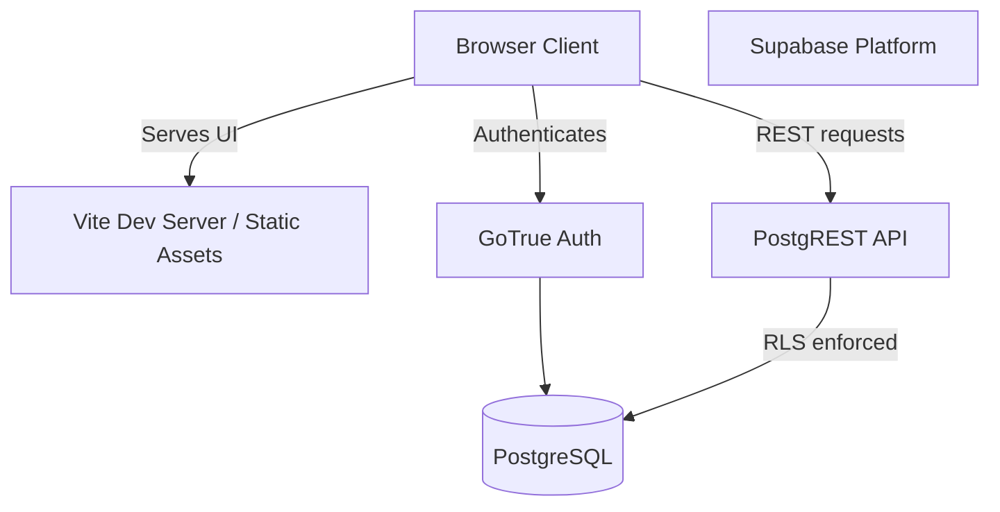

# System Architecture

KUVENTORY follows a modern, decoupled architecture focusing on simplicity, performance, and clear boundaries.



## Frontend Architecture

The React application is structured to cleanly separate configuration, UI components, feature-specific business logic, and global types.

```text
src/
├── app/                  # Application shell, providers, and routing setup
├── components/           # Generic components
│   ├── ui/               # shadcn/ui components
│   └── shared/           # Reusable generic components (e.g., standard layout shells)
├── features/             # Feature-based boundary modules
│   ├── auth/             # Login, auth state
│   ├── inventory/        # Master data management
│   ├── categories/       # Category management
│   ├── daily-inventory/  # Daily counting and forms
│   ├── batches/          # Stock batch management (FEFO)
│   ├── notifications/    # Alerting system
│   ├── reports/          # Report generation and exports
│   └── users/            # Admin user management
├── hooks/                # Global/utility hooks
├── lib/                  # Generic utilities (e.g. Supabase client, utils)
├── types/                # Global TypeScript definitions
└── main.tsx              # Entry point
```

### Feature Boundaries
We use a feature-sliced design. Each directory inside `src/features/` acts as an independent module containing its own:
- Components (specific to the feature)
- API calls (react-query hooks)
- Forms & Validation schemas
- Types (if isolated to the feature)

### Dependency Rules
1. `features/*` can import from `components/`, `lib/`, `hooks/`, and `types/`.
2. `features/*` should generally *not* import from other features to prevent tangled coupling, except for explicit shared domains (e.g., reports utilizing daily-inventory types).
3. `components/ui/` contains only dumb, presentational components.

### Form Architecture
Forms are built using `react-hook-form` coupled with `zod` for validation.
- **Uncontrolled Inputs**: To minimize re-renders, forms rely on standard HTML behavior enhanced by React Hook Form.
- **Validation**: Schema-based validation runs before any API call is initiated.

## Application States & Data Flow
There is no global state manager like Redux or Zustand.
- **Server State**: Managed exclusively by `@tanstack/react-query`.
- **Local UI State**: Managed via standard React `useState` and `useReducer` near where it's needed.
- **Context**: Used sparingly, primarily for Auth state and Theme.
