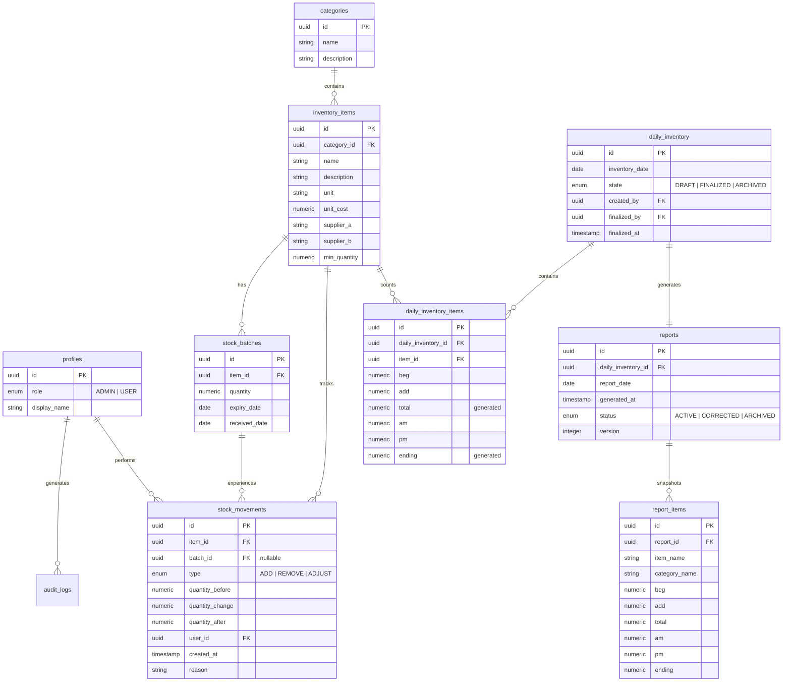

# Database Architecture

KUVENTORY utilizes PostgreSQL (via Supabase) as the primary source of truth. The database is heavily leveraged for data integrity (constraints, foreign keys, triggers) and security (Row Level Security).

## Entity Relationship Diagram

## Inventory Models

### 1. Master Data (`inventory_items`)

Stores static attributes about an item. Does not store current quantity.

### 2. Live Stock (`stock_batches`)

Stores physical counts of items bucketed by their `expiry_date` and `received_date`. The sum of all batch quantities for an item is its current live stock.

### 3. Daily Inventory Forms (`daily_inventory`)

Represents the worksheet for the day. `beg` prepopulates from the live stock. `am` and `pm` are data entry fields. `total` and `ending` are PostgreSQL generated columns calculated on the fly.

**Relationship to Live Stock:** Modifying `am` and `pm` in a `DRAFT` does **not** mutate live stock. Only upon transitioning to `FINALIZED` is the stock physically consumed via a secure backend RPC.

## FEFO Model

Consumption (removal of stock) is processed via PostgreSQL RPC functions (Stored Procedures).

1. The RPC takes `item_id` and `quantity_to_remove`.
2. It acquires a row-level lock (`SELECT ... FOR UPDATE`) on the relevant `stock_batches` ordered by `expiry_date ASC, received_date ASC`.
3. It iterates through the batches, deducting from the oldest batch first.
4. If a batch hits 0, the remainder rolls over to the next batch.
5. Atomic `stock_movements` are created for every batch touched.

## Report Snapshots

Finalized reports must be historically immutable. When generated, a trigger/RPC creates a `report` and denormalizes the `daily_inventory` data into `report_items`. Because `item_name` and `category_name` are copied directly as strings into `report_items`, the report remains perfectly intact even if the original category is deleted or renamed months later.
