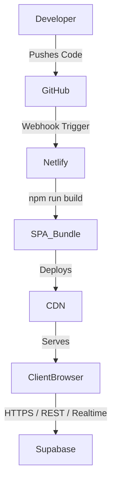

# KUVENTORY Deployment Architecture

## Overview

KUVENTORY follows a modern decoupled architecture consisting of a static frontend deployed globally and a managed PostgreSQL database with embedded business logic.

## Components

### Frontend (Netlify)

- **Role**: Serves the compiled React + Vite Single Page Application (SPA).
- **Delivery**: Global CDN with edge routing.
- **Routing**: Client-side routing is handled by React Router. Netlify is configured to fallback to `/index.html` for all paths (via `public/_redirects`).
- **Environment**: Configured via Vite build environment variables (`VITE_SUPABASE_URL`, `VITE_SUPABASE_ANON_KEY`).

### Backend (Supabase Hosted)

- **Database**: PostgreSQL handles all persistent storage.
- **Authentication**: Supabase Auth issues and verifies JWT tokens.
- **Business Logic**: Placed intimately within PostgreSQL via PL/pgSQL functions, triggers, and Row-Level Security (RLS).
- **Security**: Strict RLS isolates data between users and protects the system from arbitrary frontend mutations.

### Version Control (GitHub)

- **Role**: Source of Truth.
- **CI/CD Integration**: Netlify directly observes the `master` branch. Pushes to `master` trigger an automated build (`npm run build`) and deployment of the `dist/` folder.

## Deployment Flow

## Security Posture

- The frontend holds **no** secrets, only public Anon Keys.
- The backend relies entirely on the PostgreSQL database security model.
- Migrations are managed deterministically via Supabase CLI.
