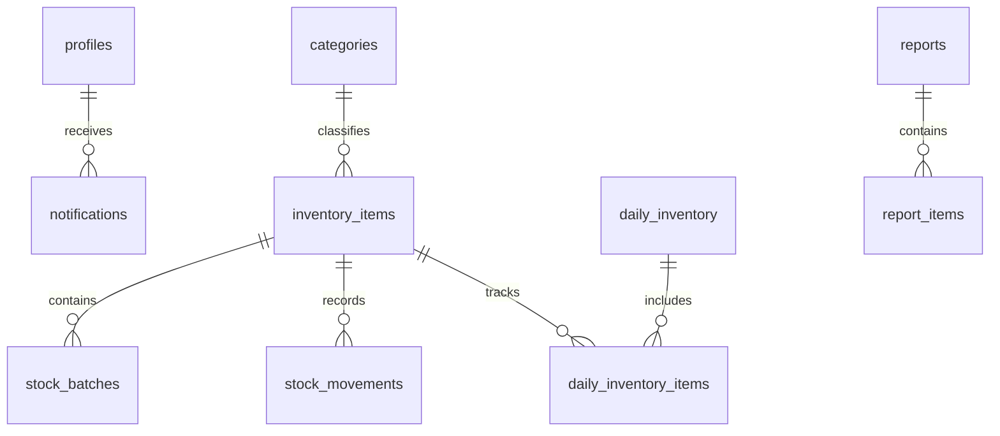

# [SYSTEM ARCHITECTURE & TECHNICAL SPECIFICATIONS] KUVENTORY™ Engineering Manual

**System Name:** KUVENTORY Enterprise Restaurant & Kiosk Inventory Management System  
**Document Code:** `DOC-03-SATS`  
**Classification:** Technical Documentation · Engineering & System Architecture  
**Production URL:** [https://kuventory.netlify.app](https://kuventory.netlify.app)  
**Version:** 2.4.0 (Production Release)  

---

## 1. High-Level Architecture Overview

KUVENTORY is built as a cloud-native, real-time single-page application (SPA) backed by a managed PostgreSQL 17 database running on Supabase, deployed globally via Netlify's high-speed CDN edge network:

```
┌─────────────────────────────────────────────────────────────────────────────┐
│                          KUVENTORY ARCHITECTURE                             │
│                                                                             │
│  [ Client Tier ]                                                            │
│    Web Browser (Mobile, Tablet, Desktop)                                    │
│    React 18 SPA · TypeScript · Vite · Tailwind CSS · TanStack Query v5      │
│                                                                             │
│                                 ▲ HTTP / WebSocket (WSS)                    │
│                                 │ HTTPS TLS 1.3 / REST API                  │
│                                 ▼                                           │
│  [ Edge / CDN Tier ]                                                        │
│    Netlify Edge Network · Automatic Asset Minification · Route Rewrites     │
│                                                                             │
│                                 ▲ PostgREST / GoTrue / Realtime             │
│                                 │ JWT Bearer Authentication                 │
│                                 ▼                                           │
│  [ Backend & Data Tier: Supabase Cloud ]                                     │
│    ├── Supabase Auth (GoTrue): Encrypted JWT Sessions                       │
│    ├── PostgreSQL 17 Database: 11 Tables · Stored Columns · RLS Policies    │
│    ├── Stored Procedures (RPCs): Atomic FEFO Allocation & Reconciliation    │
│    ├── Realtime Engine: PostgreSQL WAL Event Replication                    │
│    └── Supabase Storage: Binary Assets & Static Photography                 │
└─────────────────────────────────────────────────────────────────────────────┘
```

---

## 2. Technology Stack Specifications

| Layer | Technology | Version | Justification & Purpose |
| :--- | :--- | :--- | :--- |
| **Frontend Framework** | React | `^18.3.1` | Declarative component UI with optimized reconciliation and concurrency. |
| **Build Tooling** | Vite / Rolldown | `^6.0.0` | Ultra-fast Hot Module Replacement (HMR) and optimized bundle chunking. |
| **Language** | TypeScript | `^5.6.2` | Strict compile-time type safety preventing runtime null/undefined crashes. |
| **Styling** | Tailwind CSS + CSS3 | `^3.4.1` | Curated HSL design tokens, responsive utility classes, zero CSS bloat. |
| **Server State** | TanStack Query | `^5.62.0` | Automatic background caching, query invalidation, and optimistic mutations. |
| **Client Validation**| Zod + React Hook Form | `^3.24.1` | High-performance schema validation without unnecessary re-renders. |
| **Backend & DB** | Supabase PostgreSQL | `17.x` | ACID compliance, stored procedures, generated columns, and RLS policies. |
| **Realtime Sync** | Supabase Realtime | `^2.47.0` | Instant notification and stock status broadcast via WebSockets. |
| **Testing** | Vitest & Playwright | `^3.0` / `^1.58`| Unit tests for business math; E2E tests for browser user journeys. |
| **Deployment** | Netlify | Edge | Continuous deployment from GitHub with automated build optimization. |

---

## 3. Database Schema & Relational Integrity

The KUVENTORY PostgreSQL database is composed of 11 tightly integrated tables with foreign key constraints and generated stored arithmetic:



### Table Definitions & Roles

1. **`public.profiles`**: Stores user identities, display names, and assigned system roles (`MASTER_ADMIN`, `ADMIN`, `USER`), securely synced from `auth.users`.
2. **`public.categories`**: Classifies stock items (e.g., Beverages, Food, Packaging, Grilled Stock).
3. **`public.inventory_items`**: Catalog master records containing item names, units of measure, minimum reorder thresholds, unit costs, and active status.
4. **`public.stock_batches`**: Discrete received inventory lots tracking batch quantity, received date, expiry date, and supplier lot number.
5. **`public.stock_movements`**: Auditable immutable transaction ledger recording additions (`IN`), sales consumptions (`OUT`), and corrections (`ADJUST`).
6. **`public.daily_inventory`**: Header record for daily physical count sheets identified by `inventory_date` and workflow status (`DRAFT`, `FINALIZED`).
7. **`public.daily_inventory_items`**: Line items for each worksheet. Contains database-generated stored columns:
   - `total`: `GENERATED ALWAYS AS (beg + add) STORED`
   - `ending`: `GENERATED ALWAYS AS (beg + add - am - pm) STORED`
8. **`public.reports`**: Official immutable finalized daily inventory reports.
9. **`public.report_items`**: Immutable historical snapshots of finalized counts, frozen against future changes.
10. **`public.notifications`**: System alerts for low-stock thresholds, expiring lots, and password reset dispatches.
11. **`public.system_settings`**: Key-value administrative store for maintenance mode locks and store operational parameters.

---

## 4. Concurrency, Atomicity & Idempotency

KUVENTORY implements rigorous safeguards to protect stock integrity against race conditions and concurrent multi-user operations:

1. **Atomic FEFO Batch Depletion via Stored Procedures:**
   - Multi-batch consumption is executed inside a single PostgreSQL transaction (`consume_stock_fefo`).
   - Batches are locked with `FOR UPDATE` in order of `expiry_date ASC, created_at ASC`.
   - Prevents two baristas from deducting from the same lot simultaneously.
2. **Database-Generated Stored Columns:**
   - Calculations for `TOTAL` and `ENDING` are computed by PostgreSQL, eliminating client-side arithmetic discrepancies.
3. **Optimistic Concurrency & Deduplicated Requests:**
   - Buttons enter an immediate `isPending` disabled state upon click, preventing double-submission.
   - Network retries utilize deterministic record keys (`inventory_date + item_id`).

---

## 5. UI/UX Design System & Tokens

The visual language balances hospitality elegance with high-speed operational clarity:

### 5.1 Color Palette Tokens (Tailwind HSL)
- **Primary Burgundy (`#611A1F` / `355 58% 24%`):** Primary action buttons, active navigation pills, brand accents.
- **Brushed Gold (`#D4AF37` / `43 55% 52%`):** High-priority alerts, Master Admin badges, crown icons.
- **Espresso Dark (`#1F1816` / `15 18% 10%`):** Sidebar navigation rail and high-contrast desktop headers.
- **Warm Ivory Light (`#F6F1EC` / `34 25% 96%`):** Background canvas in light mode.
- **Charcoal Dark (`#16100E` / `15 20% 8%`):** Background canvas in dark mode.

### 5.2 Typography System
- **Display Headings:** `Playfair Display` (font-serif, weights 700/800) for page banners and brand emblems.
- **Interface & Body:** `Inter` / `Plus Jakarta Sans` (weights 400/500/600) for data grids and form controls.
- **Data & Numbers:** `JetBrains Mono` (weights 600/700) for numeric counts, stock variances, SKU codes, and lot numbers.

---

## 6. Responsive Viewport Matrix

KUVENTORY is tested across 5 viewport classes:
- **Mobile Phones (360×800, 390×844, 412×915):** Bottom navigation bar, vertically scrollable forms, touch targets $\ge 44\text{px}$.
- **Tablets (768×1024, 820×1180):** 2-column adaptive dashboard grids, collapsible navigation rail.
- **Laptops (1280×800, 1366×768, 1440×900):** Multi-column data tables, side-by-side metric charts.
- **Desktops (1920×1080):** Comprehensive full-width inventory console with quick-action panels.
