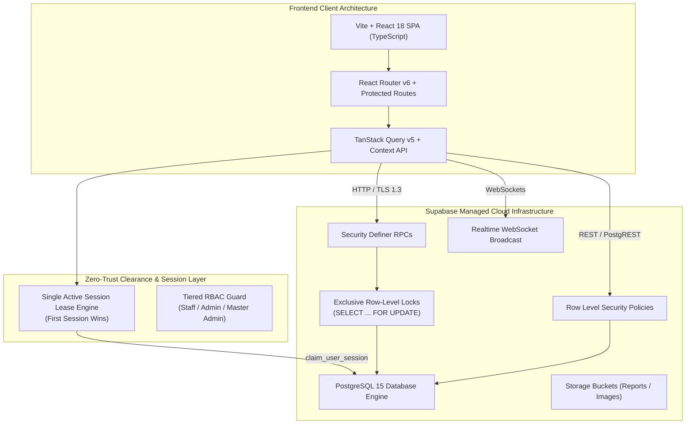

# System Architecture & Technical Topology

## 1. High-Level Architectural Diagram

## 2. Layered Component Responsibilities

### Layer 1: Client Application (Vite + React + Tailwind CSS)
- **Framework**: Vite 8 with React 18, Strict TypeScript compilation.
- **Routing**: Client-side declarative routing with `<RequireAuth>` guards enforcing role minimums (`USER`, `ADMIN`, `MASTER_ADMIN`).
- **Telemetry & Interaction Target**: 0–50ms visual responsiveness on button presses, input focus, and tab switches. Optimistic UI is limited strictly to non-destructive interactions. Authoritative inventory state is never falsified before database confirmation.

### Layer 2: Session Leasing & Security Clearance
- **Single Active Session**: Managed via `user_session_leases` table and `claim_user_session` RPC.
- **Heartbeat Daemon**: Emits lightweight ping every 15s. Grace period is 45s.
- **Revocation Dispatch**: If a session is revoked by Master Admin, the heartbeat immediately informs the client, terminates the token, and returns the device to the login screen.

### Layer 3: Database Engine (PostgreSQL 15)
- **Source of Truth**: PostgreSQL is the sole authoritative state of inventory balances, lot identities, expiration dates, and audit history.
- **Transactional Atomicity**: Stock mutations (`add_stock`, `consume_stock`, `adjust_stock`) execute within atomic transactions with row locks (`FOR UPDATE`).
- **FEFO Allocation**: Evaluates candidate batches ordered by `expiry_date ASC NULLS LAST, received_date ASC, id ASC`.

### Layer 4: Realtime Telemetry & Invalidation
- **Broadcast Invalidation**: Database mutations trigger targeted Realtime Broadcast events, prompting active browser clients viewing that specific item to refresh authoritative data without polling.
- **Fallback Durability**: If the Realtime WebSocket disconnects, the system continues operating normally over HTTPS with explicit on-demand refetching.
