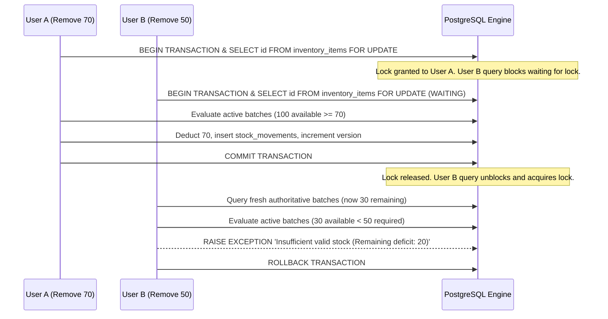

# Concurrency Control & Transaction Isolation

## 1. Concurrency Model: Dual-Layer Protection
KUVENTORY employs a dual-layer strategy to guarantee zero lost updates, zero phantom reads, and zero negative stock levels:
1. **Pessimistic Row-Level Locking (Primary)**: Critical state mutations (`add_stock`, `consume_stock`, `adjust_stock`) acquire explicit row locks (`FOR UPDATE`) in PostgreSQL.
2. **Optimistic Concurrency Control (Secondary)**: Every item in `inventory_items` and every lot in `stock_batches` maintains an integer `version` column incremented on every committed transaction.

---

## 2. Deep Dive: The Two-User Stock Deduction Race (Rule 30)

### Problem Scenario
- Starting Available Stock: **100 units**.
- User A loads page: sees 100 units.
- User B loads page: sees 100 units.
- User A submits: **Remove 70 units**.
- User B submits concurrently: **Remove 50 units**.

### PostgreSQL Execution Flow

### Result Verification
- **User A**: Transaction completes successfully.
- **User B**: Receives clear, authoritative error: *"Insufficient valid stock for item to consume 50 (Remaining deficit: 20)"*.
- **Final Authoritative Balance**: Exactly **30 units**.
- **Negative Stock Occurrence**: **0%** (Guaranteed impossible by database validation and check constraints).

---

## 3. Deep Dive: Concurrent Restocking with Different Expiry Dates (Rule 31)

### Problem Scenario
- Starting Stock: **100 units** (Batch A: Expiry Dec 10).
- User A adds **20 units** (Expiry Dec 10).
- User B adds **30 units** (Expiry Dec 25).
- Both requests arrive at the same millisecond.

### Authoritative Result
1. Both transactions acquire serialized item-level locks in sequence.
2. User A inserts a receipt record.
3. User B inserts a distinct receipt record with Expiry Dec 25.
4. **Final System State**:
   - Total Available: **150 units**.
   - Batch A: 100 units (Expiry Dec 10).
   - Batch B: 20 units (Expiry Dec 10).
   - Batch C: 30 units (Expiry Dec 25).
   - All expiration dates and receipt timestamps preserved intact. Zero overwrite!

---

## 4. Double-Submit & Idempotency Safeguards (Rule 33)
1. **Frontend Disabling**: All submission buttons enter a disabled `isSubmitting` state within 0–50ms of user tap/click.
2. **Unique Constraints**: Daily worksheets enforce `UNIQUE(date)`, preventing duplicate finalized sheets for the same business day.
3. **Deterministic Deduplication**: Notification engine generates deterministic dedup keys (`LOW_STOCK_<item_id>`, `EXPIRED_<batch_id>`), guaranteeing that repeated triggers do not duplicate alerts in the notification ledger.
