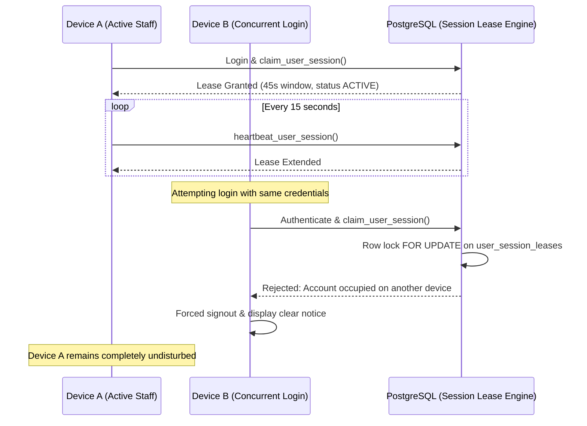

# Security & Zero-Trust Architecture

## 1. Zero-Trust Access Model
KUVENTORY operates under a Zero-Trust security model where every request is authenticated, authorized, and audited at the database boundary:
1. **Frontend Non-Authority**: Frontend navigation guards (`<RequireAuth>`) provide user experience clarity, but are NEVER trusted as authorization boundaries.
2. **Database Boundary Protection**: Every table, view, and function enforces PostgreSQL Row Level Security (RLS) or explicit role checks (`is_admin()`, `is_master_admin()`).
3. **No Browser Service Keys (Rule 110)**: The `service_role` key is strictly prohibited in frontend bundles. Only the public `anon` key is distributed. All privileged actions run through database-level `SECURITY DEFINER` RPCs that check `auth.uid()`.

---

## 2. Single Active Session Leasing Engine (Rules 11–17)
### "First Session Wins" Architecture
Unlike conventional authentication providers where new logins silently invalidate earlier sessions, KUVENTORY enforces **First Session Wins**:

### Stale Session Recovery (Rule 15)
If Device A crashes, suffers abrupt power failure, or closes all tabs without explicit logout:
- The heartbeat ceases.
- After 45 seconds, the active lease expires.
- Device B is then permitted to claim the lease atomically.

### Master Admin Session Revocation (Rule 16)
- Master Admin can view all active session leases in the Security Control Center.
- If an account is suspected of compromise or an employee leaves a session active on a lost device, Master Admin executes `revoke_user_session_by_admin(userId, reason)`.
- The lease status transitions immediately to `REVOKED`.
- Upon the next heartbeat (within 15s), the target device is logged out and returned to the login screen with the audited reason.

---

## 3. Threat Mitigation Matrix

| Threat / Attack Vector | Mitigation Strategy | Verification Mechanism |
| :--- | :--- | :--- |
| **Credential Stuffing / Brute Force** | Rate limiting, password complexity validation, secure bcrypt hashing in `auth.users`. | Automated test rejection after invalid attempts. |
| **Privilege Escalation** | `protect_profile_role` database trigger rejects role mutation by unauthorized users; Master Admin creation guarded by `is_master_admin()`. | Direct SQL / PostgREST rejection with error `Privilege escalation rejected`. |
| **Concurrent Lost Updates** | Exclusive row locks (`SELECT ... FOR UPDATE`) in `consume_stock` and `add_stock`. | Concurrency test with simultaneous requests. |
| **Session Hijacking / Replay** | Short-lived JWTs, TLS 1.3 encryption, single active session lease binding client ID and user ID. | Second login rejected while first session active. |
| **Cross-Site Scripting (XSS)** | React JSX auto-escaping, DOMPurify sanitization in report generation, strict CSP headers. | Input injection tests sanitized. |
| **Clickjacking** | Anti-clickjacking headers (`X-Frame-Options: DENY`, `frame-ancestors 'none'`). | Playwright iframe load denial check. |
