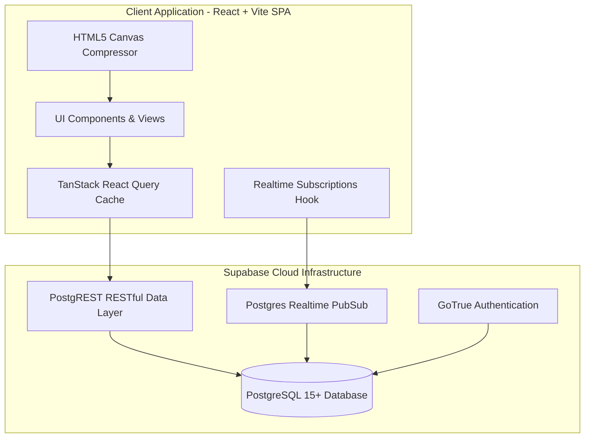

# Product Requirements Document (PRD) & Technical Specification

## 1. Product Overview
**KUVENTORY** is a production-ready, lightweight commercial inventory management system engineered for high-volume food service kiosks and central bodega storage facilities. It digitizes daily shift counts, stock movements, and batch management with automated First-Expired, First-Out (FEFO) stock consumption and immutable daily snapshot reporting.

---

## 2. Core Functional Requirements & Business Rules

### Rule 1: Daily Inventory Mathematical Equation
Every daily inventory entry strictly follows this immutable formula:
$$\text{TOTAL STOCK} = \text{BEGINNING} + \text{ADD}$$
$$\text{ENDING QUANTITY} = \text{TOTAL STOCK} - \text{SALES AM} - \text{SALES PM}$$

- **Beginning Quantity (BEG)**: Carried over from the previous day's finalized ending quantity, or set manually during worksheet initialization.
- **Stock Additions (ADD)**: Stock received during the operating day. Can be added directly on the sheet or via the stock intake modal.
- **AM / PM Sales Out**: Quantities consumed during the morning and evening shifts.
- **Ending Quantity (ENDING)**: Computed dynamically in real-time. Cannot be negative.

---

### Rule 2: First-Expired, First-Out (FEFO) Engine
Perishable goods are consumed automatically based on expiry dates:
1. Batches with valid expiration dates are ordered by `expiry_date ASC`.
2. Expired batches are excluded from active sale deductions (flagged for waste/spoilage write-off).
3. If multiple batches share the same expiry date (or have null expiry dates for non-perishables), the tie-breaker is `created_at ASC`.

---

### Rule 3: Immutable Daily Snapshots
When an inventory worksheet is finalized:
1. The session state changes from `DRAFT` to `FINALIZED`.
2. Input fields become read-only.
3. An immutable record is created in `report_snapshots` containing the full JSON payload of all items, quantities, and totals.
4. Subsequent adjustments to active catalog items do not alter past finalized snapshots.

---

## 3. System Architecture & Tech Stack

- **Frontend**: React 19, TypeScript, Vite 8, Tailwind CSS v4, Lucide Icons, Recharts, TanStack Query v5.
- **Backend**: Supabase (PostgreSQL 15+), PostgREST, Row Level Security (RLS), PL/pgSQL Functions.
- **Export Engine**: jsPDF + jsPDF-AutoTable (PDF), SheetJS (XLSX), Native RFC-4180 (CSV).
- **Deployment**: Netlify (Frontend SPA with `_redirects`) + Supabase Cloud (Managed DB).
