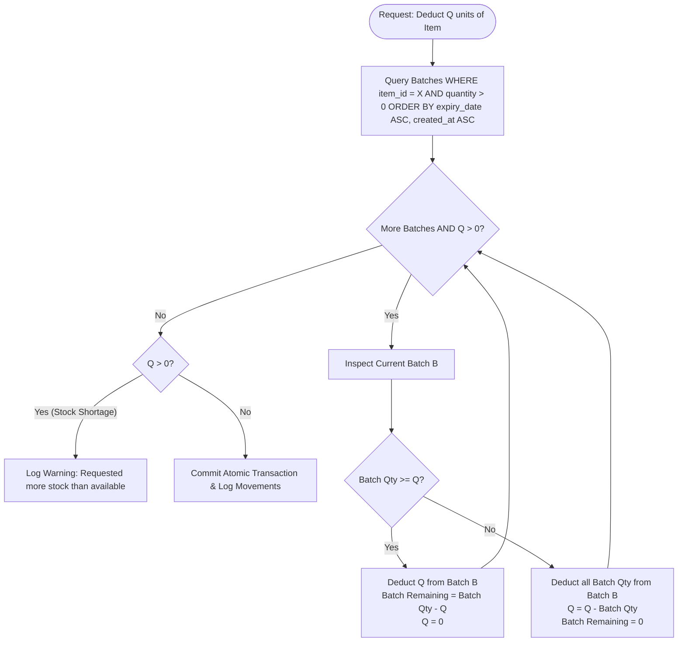

# Code Documentation & Business Logic Algorithms

## 1. First-Expired, First-Out (FEFO) Deduction Algorithm

### Algorithm Description
When inventory is consumed (via daily worksheet finalization or manual stock movement), stock must be deducted strictly from the oldest unexpired batch.



---

## 2. Client-Side HTML5 Canvas Image Compression

### Algorithm Description
To guarantee ultra-fast item loading and avoid multi-megabyte backend uploads, user-uploaded pictures from smartphones or computers are automatically resized and compressed in memory before persisting:

```typescript
export async function compressImageToDataUrl(
  file: File, 
  maxWidth = 600, 
  maxHeight = 600, 
  quality = 0.82
): Promise<string> {
  return new Promise((resolve, reject) => {
    const reader = new FileReader();
    reader.readAsDataURL(file);
    reader.onload = (event) => {
      const img = new Image();
      img.src = event.target?.result as string;
      img.onload = () => {
        let width = img.width;
        let height = img.height;

        // Maintain aspect ratio within bounding box
        if (width > height && width > maxWidth) {
          height = Math.round((height * maxWidth) / width);
          width = maxWidth;
        } else if (height > maxHeight) {
          width = Math.round((width * maxHeight) / height);
          height = maxHeight;
        }

        const canvas = document.createElement('canvas');
        canvas.width = width;
        canvas.height = height;
        const ctx = canvas.getContext('2d');
        ctx?.drawImage(img, 0, 0, width, height);

        // Export as lightweight WebP, fallback to JPEG
        const dataUrl = canvas.toDataURL('image/webp', quality) || canvas.toDataURL('image/jpeg', quality);
        resolve(dataUrl);
      };
    };
  });
}
```
- **Result**: Converts 5MB–12MB camera photos into ultra-compact ~40KB–80KB data URLs.

---

## 3. Debounced Autosave Synchronization (`InventoryRow.tsx`)

### Architecture
- Cell inputs maintain local React state for instantaneous zero-latency typing.
- Changes trigger a debounced mutation callback:
  - If values match current database values, the network request is skipped entirely.
  - If changes exist, input values are sanitized with `Math.max(0, parseFloat(val) || 0)` and transmitted to the database.
