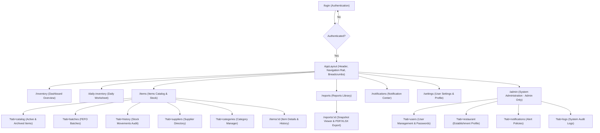
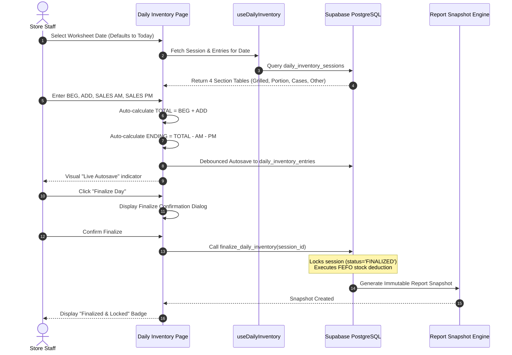
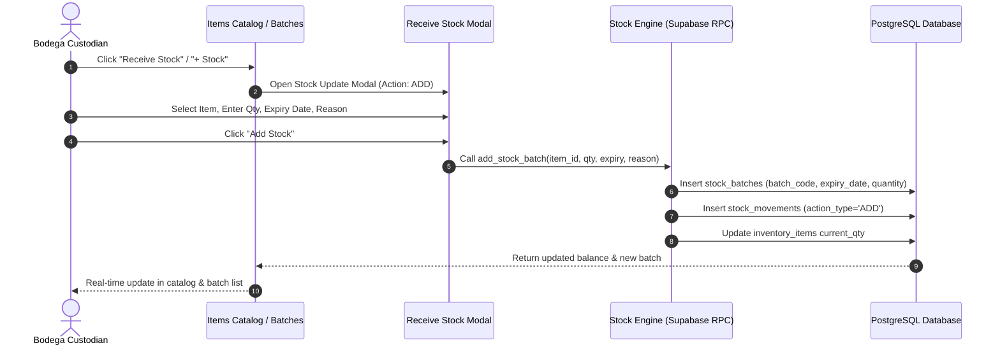
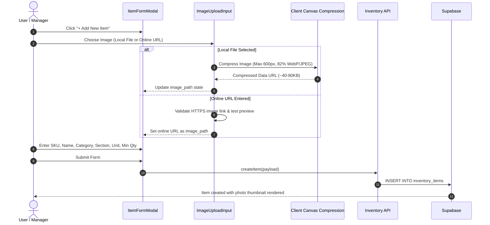

# User Flows and Sitemaps

## 1. Global Application Sitemap

---

## 2. Core User Flows

### Flow 1: Daily Inventory Recording & Finalization (Crew & Manager)

---

### Flow 2: Stock Receiving & FEFO Batch Registration

---

### Flow 3: Item Creation with Dual Image Upload (Local or Online)

