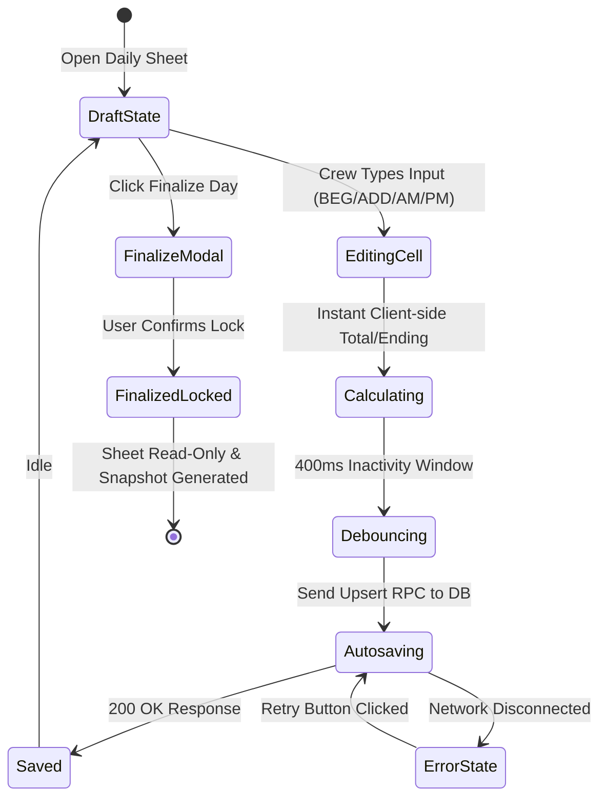

# Interactive Prototypes and Micro-Interactions

## 1. Key Interactive Behaviors

### A. Real-Time Daily Worksheet Calculations & Autosave
- **Interactive Feedback**:
  - As user inputs numbers into `BEG`, `ADD`, `SALES AM`, or `SALES PM`, `TOTAL` and `ENDING` calculate client-side instantaneously (<1ms) with zero flicker.
  - **Debounced Autosave**: After 400ms of user typing idle time, state transmits to PostgreSQL via `useUpsertDailyItem`.
  - **Autosave Status Indicator**:
    - ⏳ *Saving...* (Blue pulse)
    - ✅ *Saved* (Emerald checkmark)
    - ⚠️ *Failed to save* (Rose alert with 1-click retry)

### B. Daily Sheet Keyboard Navigation (Speed Data Entry)
- **Arrow Up / Down**: Increments/decrements numeric input by 1 unit.
- **Enter / Tab**: Automatically moves cursor focus to the next logical input cell in the row (`BEG -> ADD -> AM -> PM -> Next Row`).
- **Sanitization Guard**: Negative numbers are prohibited; negative keystrokes are cleanly clamped to `Math.max(0, val)`.

### C. Quick Action Drawer & Modals
- **Item Quick View Slide-Over (`ItemQuickViewDrawer`)**:
  - Clicking "View" or pressing eye icon triggers a slide-over panel from the right on desktop, or a bottom modal drawer on mobile.
  - Displays high-resolution item photo, real-time stock balance, minimum alert threshold, and unit cost.
- **Global Command Palette (`Ctrl+K` / `Cmd+K`)**:
  - Instantly filters through SKU, item names, suppliers, and navigation routes.
- **Collapsible Sidebar Rail (`Ctrl+[`)**:
  - Matches modern high-productivity desktop UI (ChatGPT/Slack style) collapsing from 240px full-width down to 64px compact icon rail.

---

## 2. Interactive State Diagrams

